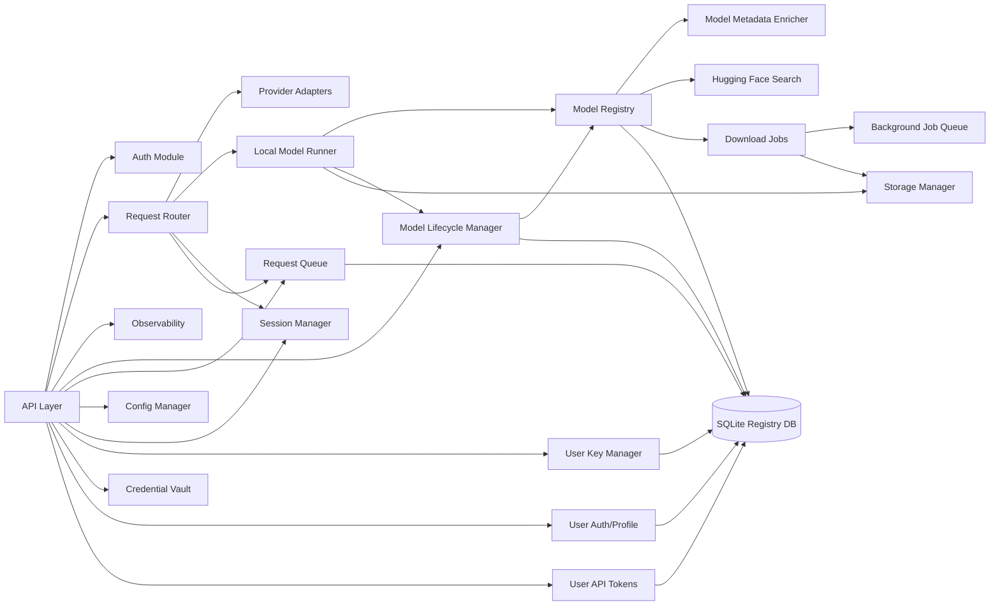
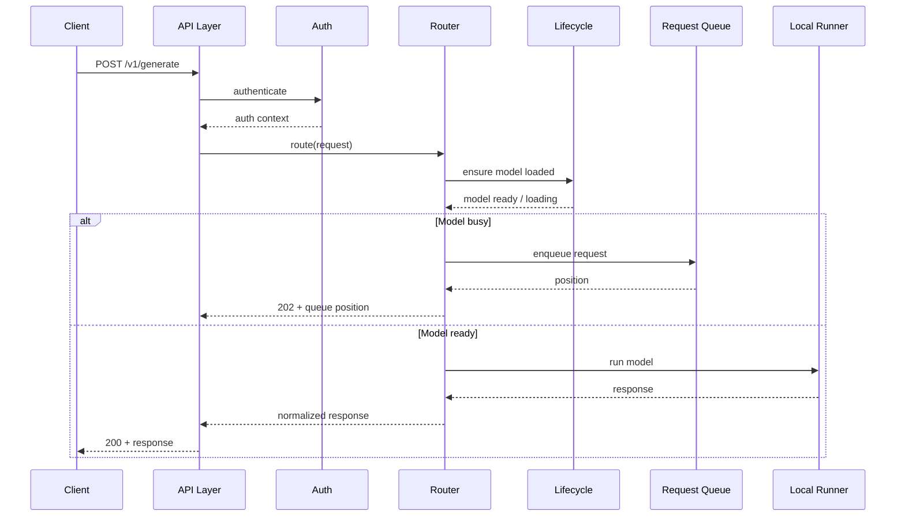
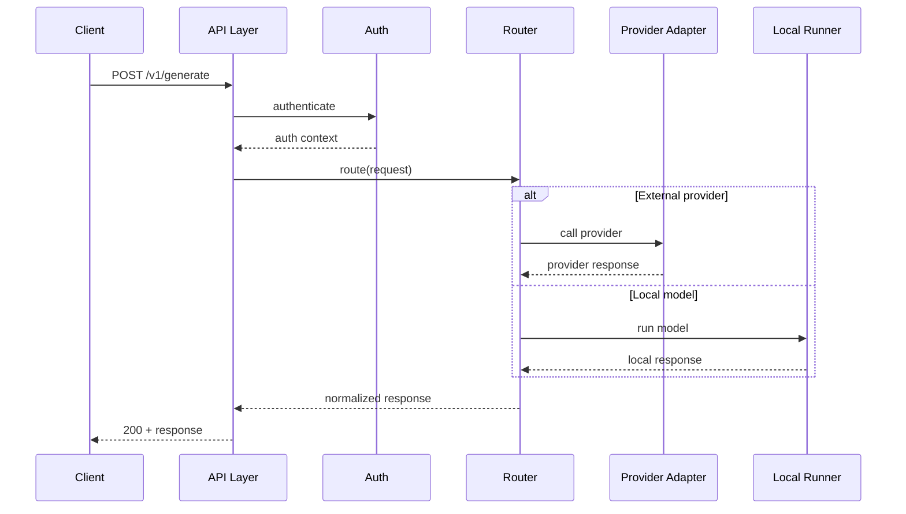
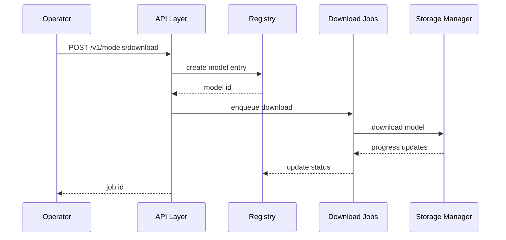
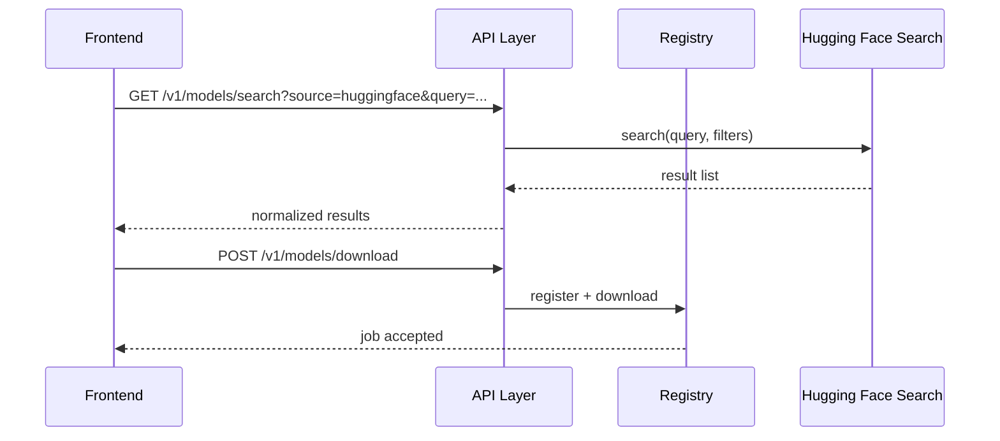
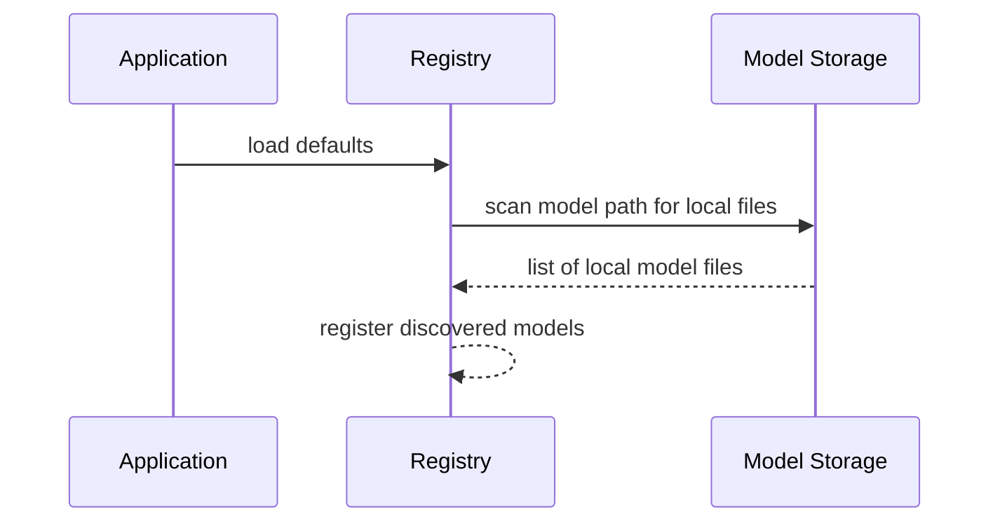
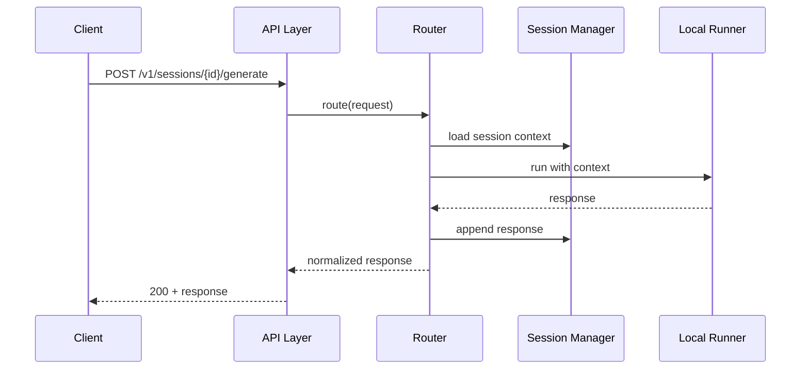

# Software Architecture — Backend Service

**Project**: Pluggably LLM API Gateway + PlugAI Frontend
**Component**: Backend Service (single deployable)
**Date**: January 26, 2026
**Status**: Updated (Pending Approval)

## Overview
This document defines the software architecture for the backend service, including module structure, interfaces between modules, and key interaction flows.

## Component Diagram (Mermaid)

## Module/Package Structure
- `api/`: FastAPI app, routing, request/response schemas
- `auth/`: auth middleware/dependencies (API key, JWT/OAuth stubs)
- `router/`: backend selection logic, model routing
- `adapters/`: provider adapters (commercial/public)
- `runner/`: local OSS model execution
- `registry/`: model registry, capabilities, catalog endpoints
- `integrations/`: external catalog integrations (Hugging Face search)
- `enrichment/`: Hugging Face metadata + model card fetcher
- `queue/`: background job scheduling/execution
- `jobs/`: download tasks, job status tracking
- `storage/`: storage limits, cache/retention policies
- `config/`: env/config file loading
- `observability/`: logging, metrics, tracing
- `sessions/`: session store and history management
- `keys/`: per-user provider/OSS key management
- `credentials/`: provider credential types and secure storage
- `users/`: invite-only auth, sessions, profiles
- `tokens/`: user API token management
- `lifecycle/`: model loading/unloading, idle timeout, LRU eviction
- `request_queue/`: request queueing, position tracking, cancellation
- `fallback/`: fallback chain configuration and execution
- `db/`: SQLite persistence (models, schemas, sessions, keys, queue)

## Interface Definitions (Module-Level)
- **API → Auth**: dependency injection for auth; returns user/token context
- **API → Router**: standardized request object → routing decision + execution
- **Router → Adapters**: provider call interface
- **Router → Runner**: local execution interface
- **Registry → DB**: CRUD model metadata, capabilities
- **Registry → Enrichment**: fetch external model docs and parameter guidance
- **Registry → Downloader**: ensure unique download per model
- **Downloader → Queue**: enqueue background download jobs
- **Enrichment → DB**: store docs/metadata in registry tables
- **Jobs → Storage**: download/cleanup operations
- **API → Registry**: list models, register/download endpoints
- **API → Registry**: model detail lookup for catalog and discovery results
- **API → Sessions**: create/list/update/close session APIs
- **Router → Sessions**: append messages and fetch session context
- **API → Keys**: manage provider and OSS keys
- **API → Creds**: manage provider credential types and secrets
- **Keys → DB**: CRUD key records and encryption metadata
- **API → Users**: invite-only registration, login/logout, profile management
- **Users → DB**: CRUD users, invites, and preferences
- **API → Tokens**: create/list/revoke user API tokens
- **Tokens → DB**: CRUD token records (hashed)
- **API → Lifecycle**: load/unload models, query runtime status, list loaded models
- **Lifecycle → Registry**: get model metadata for loading
- **Lifecycle → Runner**: load/unload model in memory
- **Lifecycle → DB**: persist model runtime state
- **API → ReqQueue**: enqueue requests, query position, cancel requests
- **Router → ReqQueue**: check queue before processing, add to queue if busy
- **ReqQueue → DB**: persist queue state for recovery
- **Router → Fallback**: get fallback chain, try alternatives on failure
- **API → CatalogSearch**: proxy Hugging Face catalog queries

## Sequence Diagrams (Mermaid)

### Text/Image/3D Request Flow with Lifecycle

### Text/Image/3D Request Flow (Legacy)

### Model Download Job Flow

### Hugging Face Catalog Search Flow

### Startup Model Discovery Flow

### Session Request Flow

## Technology & Framework Choices (Draft)
- **Framework**: FastAPI (async, OpenAPI generation)
- **DB**: SQLite initially (upgradeable to Postgres)
- **Jobs**: Background task queue (RQ/Celery) or built-in async tasks
- **ORM**: SQLAlchemy/SQLModel
- **Auth**: API key + JWT/OAuth (configurable)

## Design Patterns
- Adapter pattern for providers
- Strategy pattern for routing/model selection
- Repository pattern for registry/data access

## Error Handling
- Standardized error codes and messages across modules
- Map provider errors to internal error types
- Return validation errors for bad inputs

## Traceability
System → Software

| System Req ID | Software Component | User Story ID(s) | Notes |
|---|---|---|---|
| SYS-REQ-001 | Backend | US-001 | |
| SYS-REQ-002 | Backend | US-002 | |
| SYS-REQ-003 | Backend | US-003 | |
| SYS-REQ-004 | Backend | US-001, US-003 | |
| SYS-REQ-005 | Backend | US-001, US-006 | |
| SYS-REQ-006 | Backend | US-002 | |
| SYS-REQ-007 | Backend | US-001 | |
| SYS-REQ-008 | Backend | US-008 | |
| SYS-REQ-009 | Backend | US-009 | |
| SYS-REQ-010 | Backend | US-004 | |
| SYS-REQ-011 | Backend | US-006 | |
| SYS-REQ-012 | Backend | US-005 | |
| SYS-REQ-013 | Backend | US-004 | |
| SYS-REQ-014 | Backend | US-007 | |
| SYS-REQ-015 | Backend | US-010 | |
| SYS-REQ-018 | Backend | US-013 | Model auto-discovery |
| SYS-REQ-019 | Backend | US-014 | Parameter documentation |
| SYS-REQ-020 | Backend | US-015 | Session management |
| SYS-REQ-021 | Backend | US-016 | Session lifecycle |
| SYS-REQ-033 | Backend | US-017 | Registry persistence |
| SYS-REQ-034 | Backend | US-018 | Schema registry sync |
| SYS-REQ-035 | Backend | US-019 | User provider keys |
| SYS-REQ-036 | Backend | US-020 | User OSS keys |
| SYS-REQ-037 | Backend | US-021 | Invite-only auth |
| SYS-REQ-038 | Backend | US-022 | User profiles/preferences |
| SYS-REQ-039 | Backend | US-023 | User API tokens |
| SYS-REQ-040 | Backend | US-024 | HF documentation enrichment |
| SYS-REQ-042 | Backend | US-025 | Async downloads |
| SYS-REQ-043 | Backend | US-025 | Model status |
| SYS-REQ-044 | Backend | US-025 | Download dedupe |
| SYS-REQ-045 | Backend | US-026 | Model lifecycle |
| SYS-REQ-046 | Backend | US-027 | Request queueing |
| SYS-REQ-047 | Backend | US-028 | Request cancellation |
| SYS-REQ-048 | Backend | US-029 | Regenerate/retry |
| SYS-REQ-049 | Backend | US-030 | Prepare/load model |
| SYS-REQ-050 | Backend | US-031 | Model runtime status |
| SYS-REQ-051 | Backend | US-032 | Get loaded models |
| SYS-REQ-052 | Backend | US-033 | Default pinned model |
| SYS-REQ-053 | Backend | US-034 | Fallback configuration |
| SYS-REQ-063 | Backend | US-039 | Hugging Face search |
| SYS-REQ-064 | Backend | US-040 | Provider credential types |
| SYS-REQ-065 | Backend | US-036 | Sessions list contract |
| SYS-REQ-066 | Backend | US-037 | Session naming |
| SYS-REQ-067 | Backend | US-038 | Message timestamps |
| SYS-REQ-068 | Backend | US-041 | Health check endpoint |

## Definition of Ready / Done
**Ready**
- Modules identified and interfaces defined.
- Diagrams render correctly.

**Done**
- Interface contracts implemented for key endpoints.
- Traceability matrix updated.
- Reviewed and approved by user.
