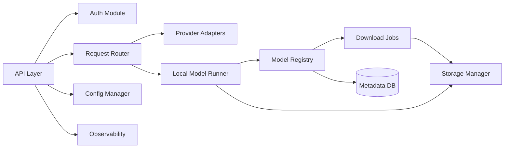
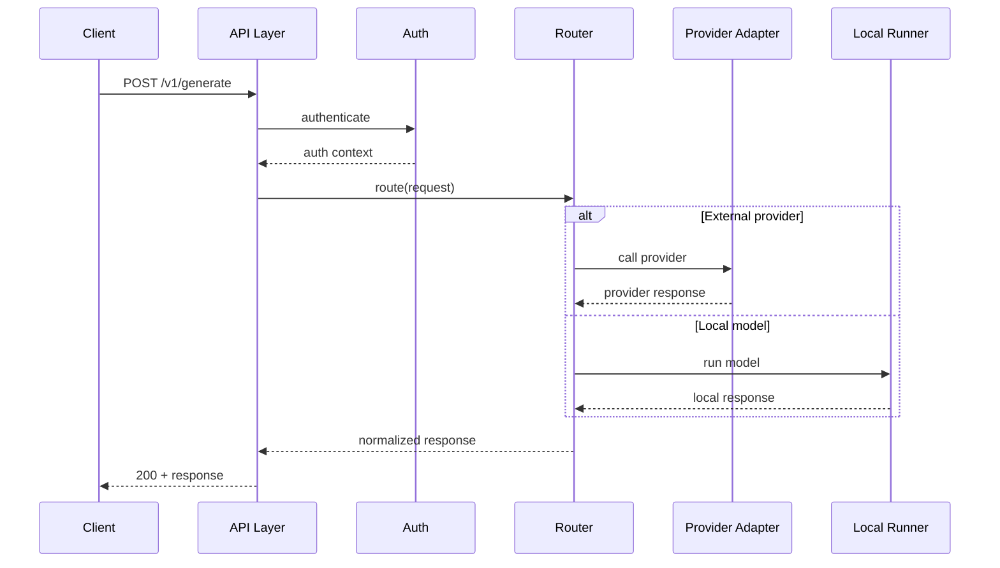
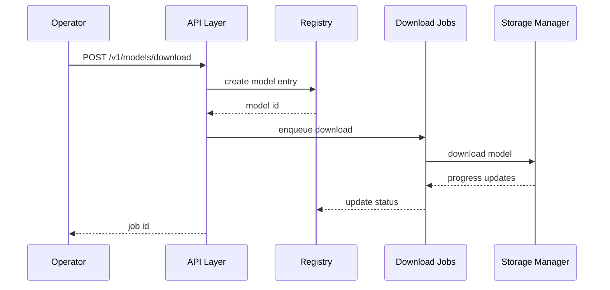

# Software Architecture — Backend Service

**Project**: Pluggably LLM API Gateway
**Component**: Backend Service (single deployable)
**Date**: January 24, 2026
**Status**: Approved

## Overview
This document defines the software architecture for the backend service, including module structure, interfaces between modules, and key interaction flows.

## Component Diagram (Mermaid)

## Module/Package Structure
- `api/`: FastAPI app, routing, request/response schemas
- `auth/`: auth middleware/dependencies (API key, JWT/OAuth stubs)
- `router/`: backend selection logic, model routing
- `adapters/`: provider adapters (commercial/public)
- `runner/`: local OSS model execution
- `registry/`: model registry, capabilities, catalog endpoints
- `jobs/`: download tasks, job status tracking
- `storage/`: storage limits, cache/retention policies
- `config/`: env/config file loading
- `observability/`: logging, metrics, tracing
- `db/`: metadata persistence (models, jobs, tokens)

## Interface Definitions (Module-Level)
- **API → Auth**: dependency injection for auth; returns user/token context
- **API → Router**: standardized request object → routing decision + execution
- **Router → Adapters**: provider call interface
- **Router → Runner**: local execution interface
- **Registry → DB**: CRUD model metadata, capabilities
- **Jobs → Storage**: download/cleanup operations
- **API → Registry**: list models, register/download endpoints

## Sequence Diagrams (Mermaid)

### Text/Image/3D Request Flow

### Model Download Job Flow

## Technology & Framework Choices (Draft)
- **Framework**: FastAPI (async, OpenAPI generation)
- **DB**: SQLite initially (upgradeable to Postgres)
- **Jobs**: Background task queue (RQ/Celery) or built-in async tasks
- **ORM**: SQLAlchemy/SQLModel
- **Auth**: API key + JWT/OAuth (configurable)

## Design Patterns
- Adapter pattern for providers
- Strategy pattern for routing/model selection
- Repository pattern for registry/data access

## Error Handling
- Standardized error codes and messages across modules
- Map provider errors to internal error types
- Return validation errors for bad inputs

## Traceability
System → Software

| System Req ID | Software Component | User Story ID(s) | Notes |
|---|---|---|---|
| SYS-REQ-001 | Backend | US-001 | |
| SYS-REQ-002 | Backend | US-002 | |
| SYS-REQ-003 | Backend | US-003 | |
| SYS-REQ-004 | Backend | US-001, US-003 | |
| SYS-REQ-005 | Backend | US-001, US-006 | |
| SYS-REQ-006 | Backend | US-002 | |
| SYS-REQ-007 | Backend | US-001 | |
| SYS-REQ-008 | Backend | US-008 | |
| SYS-REQ-009 | Backend | US-009 | |
| SYS-REQ-010 | Backend | US-004 | |
| SYS-REQ-011 | Backend | US-006 | |
| SYS-REQ-012 | Backend | US-005 | |
| SYS-REQ-013 | Backend | US-004 | |
| SYS-REQ-014 | Backend | US-007 | |
| SYS-REQ-015 | Backend | US-010 | |

## Definition of Ready / Done
**Ready**
- Modules identified and interfaces defined.
- Diagrams render correctly.

**Done**
- Interface contracts implemented for key endpoints.
- Traceability matrix updated.
- Reviewed and approved by user.
