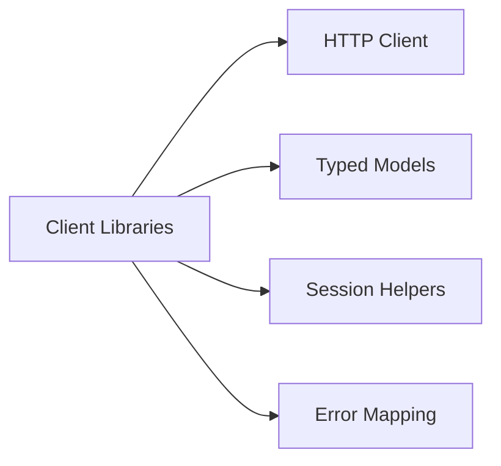
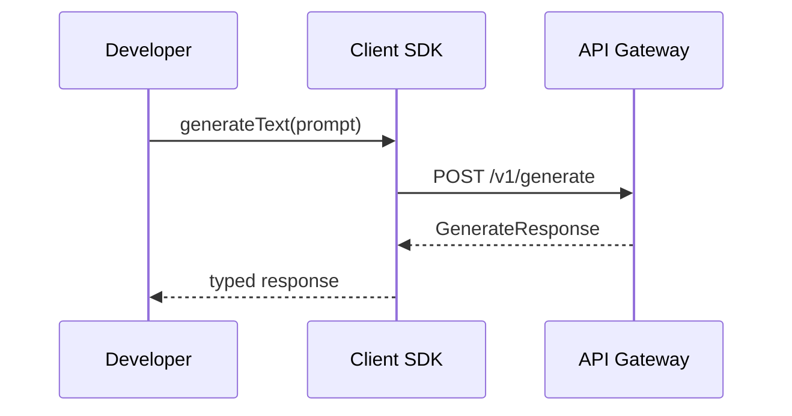

# Software Architecture — Client Library

**Project**: Pluggably LLM API Gateway
**Component**: Client Library
**Date**: January 24, 2026
**Status**: Approved (Baseline + CR-2026-01-24-03)

## Overview
Defines the client library structure, interfaces, and interaction with the API gateway for Python and Dart/Flutter.

## Component Diagram (Mermaid)

## Module/Package Structure
- `client/`: public client entrypoint
- `models/`: typed request/response models
- `sessions/`: session helper utilities
- `errors/`: error mapping and exception types
- `http/`: HTTP transport and retry settings

## Interface Definitions
- **SDK → HTTP**: sends requests, handles auth headers
- **SDK → Models**: serializes/deserializes payloads
- **SDK → Sessions**: wraps session lifecycle endpoints

## Sequence Diagram (Mermaid)

## Traceability
System → Software

| System Req ID | Software Component | User Story ID(s) | Notes |
|---|---|---|---|
| SYS-REQ-023 | Client Library | US-CL-001 | Typed SDK |
| SYS-REQ-024 | Client Library | US-CL-002 | Session helpers |

## Definition of Ready / Done
**Ready**
- Interfaces defined and diagrams render.

**Done**
- Implementation matches contract and tests pass.
