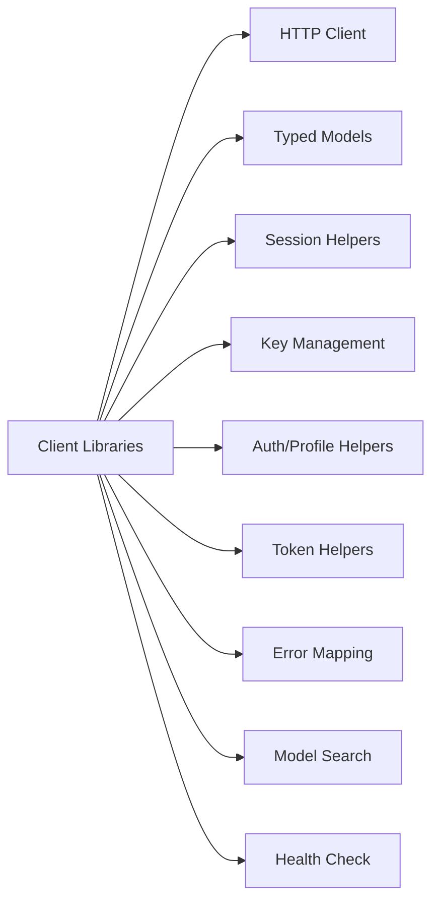
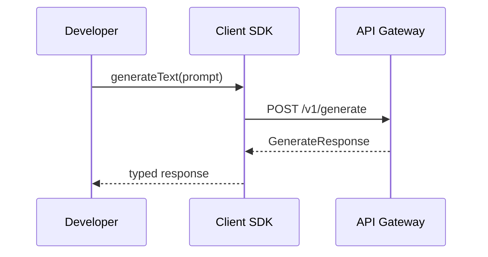

# Software Architecture — Client Library

**Project**: Pluggably LLM API Gateway + PlugAI Frontend
**Component**: Client Library
**Date**: January 26, 2026
**Status**: Updated (Pending Approval)

## Overview
Defines the client library structure, interfaces, and interaction with the API gateway for Python and Dart/Flutter.

## Component Diagram (Mermaid)

## Module/Package Structure
- `client/`: public client entrypoint
- `models/`: typed request/response models
- `sessions/`: session helper utilities
- `keys/`: user provider/OSS key management
- `users/`: auth, invites, profiles
- `tokens/`: user API token helpers
- `errors/`: error mapping and exception types
- `http/`: HTTP transport and retry settings
- `catalog/`: model search helpers (Hugging Face)
- `health/`: health check helper

## Interface Definitions
- **SDK → HTTP**: sends requests, handles auth headers
- **SDK → Models**: serializes/deserializes payloads
- **SDK → Sessions**: wraps session lifecycle endpoints
- **SDK → Keys**: wraps user provider/OSS key endpoints
- **SDK → Users**: wraps invite-only registration, login/logout, profile endpoints
- **SDK → Tokens**: wraps user API token endpoints
- **SDK → Catalog**: wraps model search endpoint
- **SDK → Health**: wraps health endpoint

## Sequence Diagram (Mermaid)

## Traceability
System → Software

| System Req ID | Software Component | User Story ID(s) | Notes |
|---|---|---|---|
| SYS-REQ-023 | Client Library | US-CL-001 | Typed SDK |
| SYS-REQ-024 | Client Library | US-CL-002 | Session helpers |
| SYS-REQ-035 | Client Library | US-CL-003 | User provider keys |
| SYS-REQ-036 | Client Library | US-CL-003 | User OSS keys |
| SYS-REQ-037 | Client Library | US-CL-004 | Auth/profile helpers |
| SYS-REQ-038 | Client Library | US-CL-004 | Auth/profile helpers |
| SYS-REQ-039 | Client Library | US-CL-005 | User API tokens |
| SYS-REQ-063 | Client Library | US-CL-012 | Hugging Face search |
| SYS-REQ-065 | Client Library | US-CL-013 | Sessions list parsing |
| SYS-REQ-066 | Client Library | US-CL-013 | Session naming metadata |
| SYS-REQ-067 | Client Library | US-CL-013 | Message timestamps |
| SYS-REQ-068 | Client Library | US-CL-014 | Health check helper |

## Definition of Ready / Done
**Ready**
- Interfaces defined and diagrams render.

**Done**
- Implementation matches contract and tests pass.
