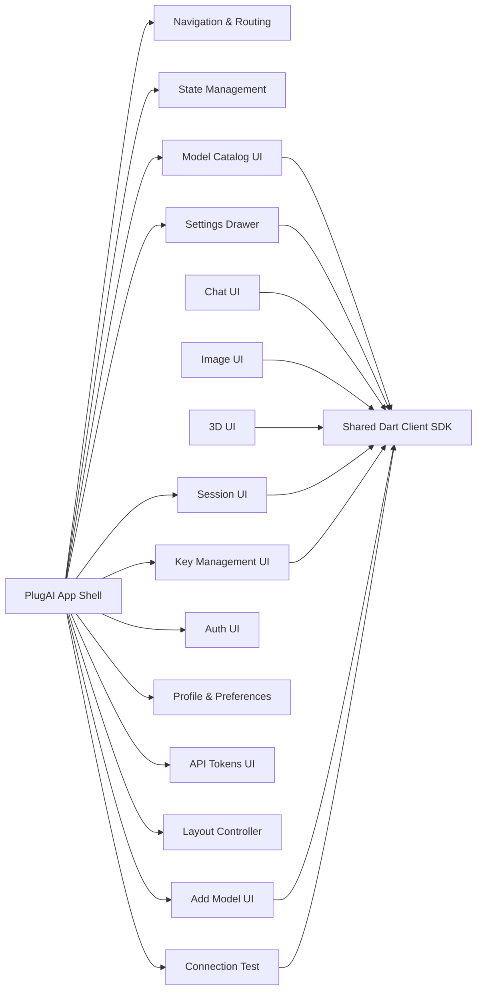
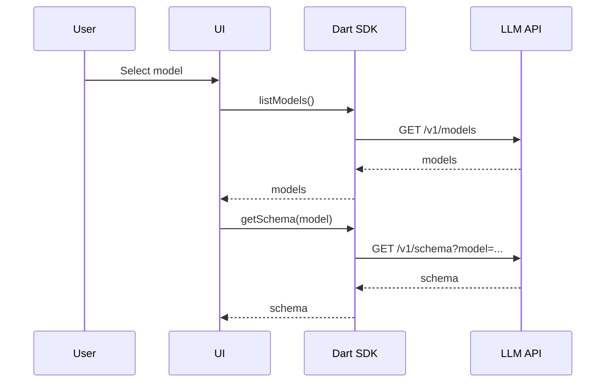
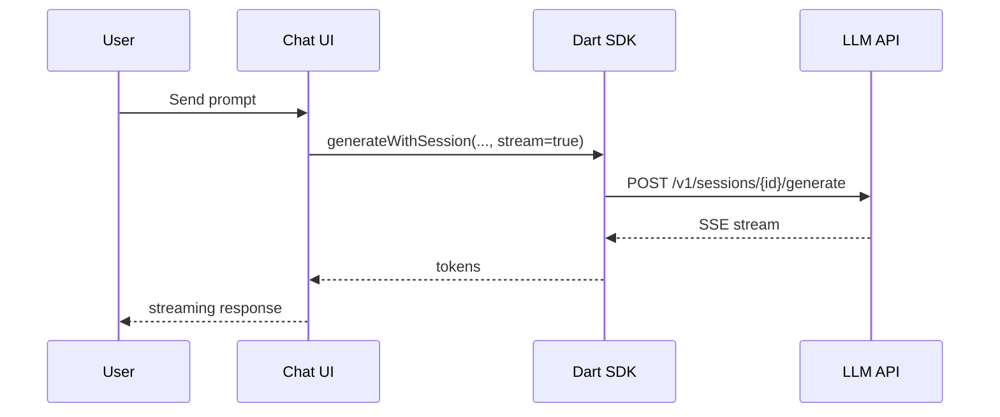
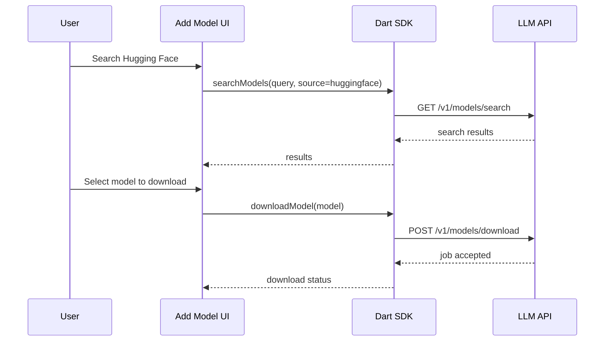
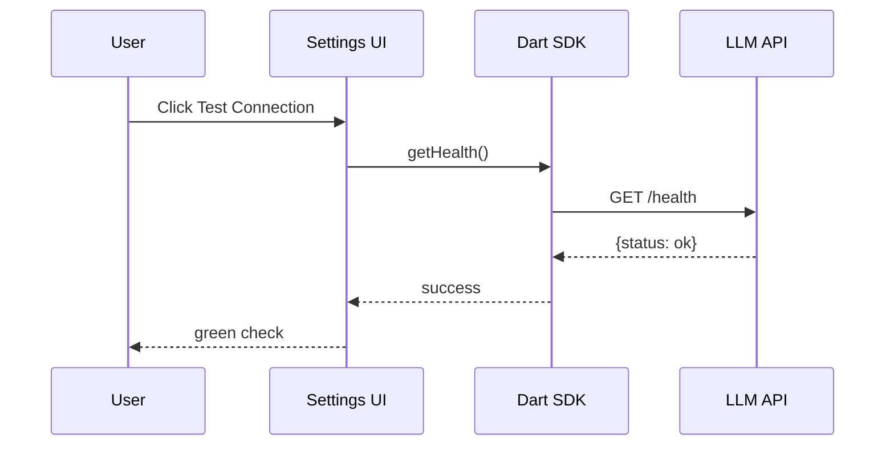

# Software Architecture — PlugAI Frontend

**Project**: Pluggably LLM API Gateway + PlugAI Frontend
**Component**: Frontend (Flutter Web/Mobile)
**Date**: January 26, 2026
**Status**: Updated (Pending Approval)

## Overview
Defines the frontend component architecture for the PlugAI cross-platform app. The frontend uses the Dart client SDK to interact with the LLM API and renders modality-specific UIs with a dynamic settings panel.

## Component Diagram (Mermaid)

## Module/Package Structure
- `app/`: root app, routing, theme, shell
- `state/`: state management (models, sessions, settings, auth)
- external: `clients/dart` package (`pluggably_llm_client`)
- `features/models/`: model catalog, modality tabs
- `features/settings/`: dynamic parameter drawer
- `features/health/`: connection test UI
- `features/chat/`: chat UI and streaming renderer
- `features/images/`: image gallery UI
- `features/three_d/`: 3D viewer UI
- `features/sessions/`: session list and switching
- `features/keys/`: provider/OSS key management UI
- `features/auth/`: invite-only registration, login/logout
- `features/profile/`: user preferences
- `features/tokens/`: user API tokens
- `features/add_model/`: Hugging Face search + model download flow
- `features/layout/`: auto-switch and manual layout selection
- `widgets/`: shared UI components

## Interface Definitions
- **UI → State**: user actions update app state (selected model, parameters, session)
- **State → SDK**: state triggers shared Dart client calls (models, schema, generate, sessions, model search, health)
- **SDK → API**: HTTP requests to backend

## Sequence Diagrams (Mermaid)

### Model Selection + Parameter Drawer

### Chat Send + Stream

### Add Model (Hugging Face Search + Download)

### Settings Connection Test

## Technology & Framework Choices
- **Framework**: Flutter (web + mobile)
- **State**: Riverpod
- **Networking**: Dart client SDK (HTTP)
- **3D Viewer**: TBD (options: `three_dart` + OBJLoader for current OBJ artifacts, or `model_viewer_plus` if backend emits GLB/GLTF)

## Error Handling
- Inline validation errors on parameters
- Toasts/banners for network failures
- Retry actions for transient errors

## Traceability
System → Software

| System Req ID | Software Component | User Story ID(s) | Notes |
|---|---|---|---|
| SYS-REQ-025 | Frontend | US-FE-001 | UI availability |
| SYS-REQ-026 | Frontend | US-FE-001, US-FE-002 | Model selection |
| SYS-REQ-027 | Frontend | US-FE-003 | Dynamic parameters |
| SYS-REQ-028 | Frontend | US-FE-004 | Chat UI |
| SYS-REQ-029 | Frontend | US-FE-005 | Image UI |
| SYS-REQ-030 | Frontend | US-FE-006 | 3D UI |
| SYS-REQ-031 | Frontend | US-FE-008 | Separate hosting |
| SYS-REQ-032 | Frontend | US-FE-004, US-FE-007 | Sessions |
| SYS-REQ-035 | Frontend | US-FE-009 | User provider keys |
| SYS-REQ-036 | Frontend | US-FE-010 | OSS keys |
| SYS-REQ-037 | Frontend | US-FE-011 | Invite-only auth |
| SYS-REQ-038 | Frontend | US-FE-012 | User preferences |
| SYS-REQ-039 | Frontend | US-FE-013 | User API tokens |
| SYS-REQ-041 | Frontend | US-FE-014 | UI auto-switch/lock |
| SYS-REQ-063 | Frontend | US-FE-023 | Add model flow |
| SYS-REQ-064 | Frontend | US-FE-024 | Provider credentials UI |
| SYS-REQ-065 | Frontend | US-FE-025 | Left-pane sessions list |
| SYS-REQ-066 | Frontend | US-FE-026 | Session naming |
| SYS-REQ-067 | Frontend | US-FE-027 | Message timestamps |
| SYS-REQ-068 | Frontend | US-FE-028 | Connection test |

## Definition of Ready / Done
**Ready**
- Components identified and interfaces defined.
- Diagrams render correctly.

**Done**
- Implementation matches architecture.
- Traceability updated.
