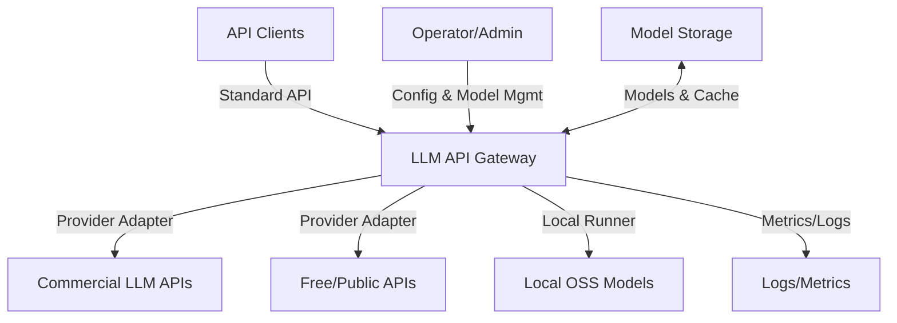
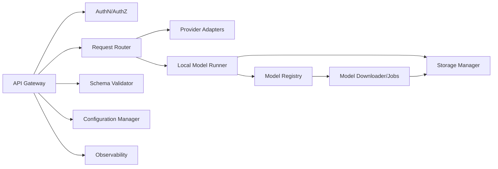
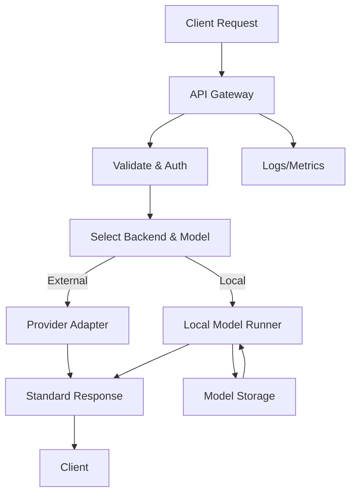

# System Architecture

**Project**: Pluggably LLM API Gateway
**Date**: January 24, 2026
**Status**: Approved (Baseline + CR-2026-01-24-01)

## Overview
This document defines the system-level architecture for a standard API that routes requests to commercial APIs, free/public APIs (if available), and local OSS models. It also covers model registry/download, storage management, and observability.

## System Context Diagram (Mermaid)

## System Decomposition
Primary system elements:
1. **API Gateway**: Exposes standard API, auth, routing, validation.
2. **Provider Adapters**: Normalizes calls to external APIs.
3. **Local Model Runner**: Executes local OSS models (text/image/3D).
4. **Model Registry & Downloader**: Tracks model metadata, handles downloads/updates, and auto-discovers local model files.
5. **Storage Manager**: Enforces storage limits, cache/retention policies.
6. **Observability**: Structured logs, metrics, request tracing.
7. **Configuration Manager**: Manages API keys, endpoints, model paths.

## System Element Diagram (Mermaid)

## Interface Definitions (Summary)
- **Client → Gateway**: Standard HTTP API (OpenAPI contract required).
- **Client → Gateway**: API schema/parameter documentation endpoint.
- **Gateway → Adapters**: Provider-specific API calls (HTTP).
- **Gateway → Local Runner**: Internal RPC or in-process call.
- **Registry/Downloader → Storage**: Filesystem or object storage abstraction.
- **Gateway → Observability**: Logs/metrics interface.

## Data Flow Diagram (Mermaid)

## Technology Stack (Initial Proposal)
- **Language**: Python
- **API Framework**: FastAPI (OpenAPI-first, async-friendly)
- **Task/Jobs**: Background worker (Celery/RQ) or FastAPI background tasks for downloads
- **Model Execution**: Local runners (e.g., Hugging Face Transformers, vLLM, llama.cpp wrappers, diffusion pipelines)
- **Config**: Env vars + config file (YAML/JSON)
- **Observability**: Structured logging + Prometheus metrics

## Architectural Decisions (Draft)
- Standard API should be OpenAPI-documented for tooling and client generation.
- Local model management includes registry + download jobs to handle large artifacts.
- Storage management must support cleanup and capacity enforcement.

## Non-Functional Considerations
- **Security**: Auth required for API access, secrets never logged.
- **Reliability**: Timeouts, retries for external providers.
- **Performance**: Optional streaming responses, configurable concurrency.
- **Maintainability**: Adapter-based provider integration.

## Assumptions
- Target deployments include home server and cloud environments.
- GPU is optional but supported when available.

## Risks & Mitigations (Lightweight)
- **Large model size** → enforce storage limits, background downloads.
- **Provider API drift** → adapter layer + versioning.
- **Hardware variability** → support CPU-only fallbacks.

## Definition of Ready / Done
**Ready**
- All system elements identified and diagrams render.
- Interfaces summarized with contracts planned.

**Done**
- Interface contracts implemented (OpenAPI/Schema).
- Traceability updated to system requirements.
- Reviewed and approved by user.

## Traceability
System → Software (per software component)

| System Req ID | Software Component | User Story ID(s) | Notes |
|---|---|---|---|
| SYS-REQ-001 | Backend | US-001 | |
| SYS-REQ-002 | Backend | US-002 | |
| SYS-REQ-003 | Backend | US-003 | |
| SYS-REQ-004 | Backend | US-001, US-003 | |
| SYS-REQ-005 | Backend | US-001, US-006 | |
| SYS-REQ-006 | Backend | US-002 | |
| SYS-REQ-007 | Backend | US-001 | |
| SYS-REQ-008 | Backend | US-008 | |
| SYS-REQ-009 | Backend | US-009 | |
| SYS-REQ-010 | Backend | US-004 | |
| SYS-REQ-011 | Backend | US-006 | |
| SYS-REQ-012 | Backend | US-005 | |
| SYS-REQ-013 | Backend | US-004 | |
| SYS-REQ-014 | Backend | US-007 | |
| SYS-REQ-015 | Backend | US-010 | |
| SYS-REQ-016 | Backend | US-012 | Artifact store |
| SYS-REQ-017 | Backend | US-011 | Streaming |
| SYS-REQ-018 | Backend | US-013 | Model auto-discovery |
| SYS-REQ-019 | Backend | US-014 | Parameter documentation |
