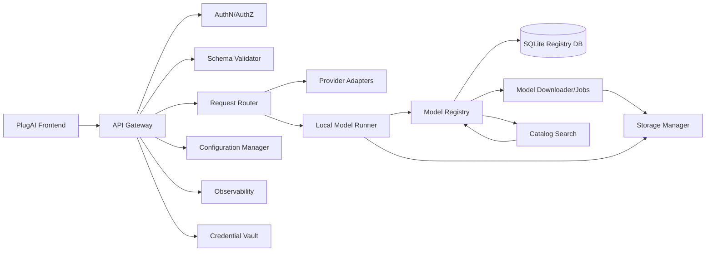
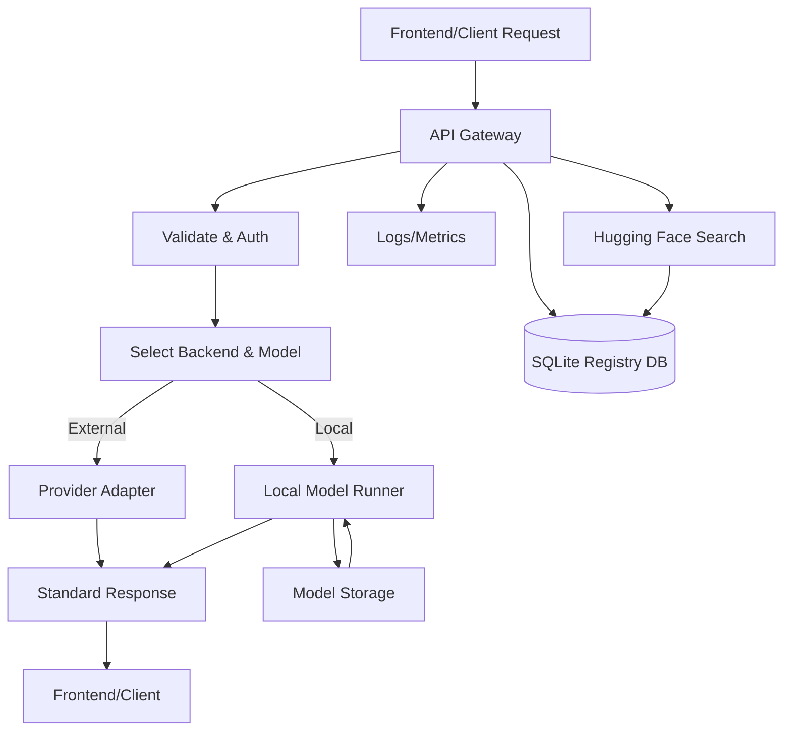

# System Architecture

**Project**: Pluggably LLM API Gateway + Cross-Platform Frontend (PlugAI)
**Date**: January 26, 2026
**Status**: Updated (Pending Approval)

## Overview
This document defines the system-level architecture for a standard API plus a cross-platform frontend that routes requests to commercial APIs, free/public APIs (if available), and local OSS models. It also covers model registry/download, storage management, observability, and per-user key management.

## System Context Diagram (Mermaid)
```mermaid
graph TD
    Frontend[PlugAI Frontend (Web/Mobile)] -->|Standard API| Gateway[LLM API Gateway]
    Client[API Clients] -->|Standard API| Gateway
    Gateway -->|Provider Adapter| Commercial[Commercial LLM APIs]
    Gateway -->|Provider Adapter| Public[Free/Public APIs]
    Gateway -->|Local Runner| LocalModels[Local OSS Models]
    Gateway -->|Catalog Search| HuggingFace[Hugging Face Hub]
    Gateway -->|Metrics/Logs| Observability[Logs/Metrics]
    Admin[Operator/Admin] -->|Config & Model Mgmt| Gateway
    Storage[Model Storage] <-->|Models & Cache| Gateway
    RegistryDB[(SQLite Registry DB)] <-->|Models/Schema/Keys| Gateway
```

## System Decomposition
Primary system elements:
1. **Frontend (PlugAI)**: Cross-platform UI (web/mobile) for model selection, chat, and modality-specific workflows.
2. **API Gateway**: Exposes standard API, auth, routing, validation.
3. **Provider Adapters**: Normalizes calls to external APIs.
4. **Local Model Runner**: Executes local OSS models (text/image/3D).
5. **Model Registry & Downloader**: Tracks model metadata, handles downloads/updates, and auto-discovers local model files.
6. **Registry DB (SQLite)**: Persists models, parameter schemas, sessions, and per-user keys.
7. **Storage Manager**: Enforces storage limits, cache/retention policies.
8. **Observability**: Structured logs, metrics, request tracing.
9. **Configuration Manager**: Manages API keys, endpoints, model paths.
10. **Session Manager**: Stores and retrieves session context and history. Session state is persisted independently of model processes, ensuring sessions survive model spindown and can be resumed after model reload.
11. **Model Catalog Search**: Searches Hugging Face for new models to download/register.
12. **Credential Vault**: Stores per-user commercial provider credentials with typed auth schemes.

## System Element Diagram (Mermaid)


## Interface Definitions (Summary)
- **Frontend → Gateway**: Standard HTTP API (OpenAPI contract required).
- **Client → Gateway**: Standard HTTP API (OpenAPI contract required).
- **Client → Gateway**: API schema/parameter documentation endpoint.
- **Client → Gateway**: Session management endpoints (create/list/update/close).
- **Frontend → Gateway**: User key management endpoints (provider keys, OSS keys).
- **Gateway → Adapters**: Provider-specific API calls (HTTP).
- **Gateway → Local Runner**: Internal RPC or in-process call.
- **Registry/Downloader → Storage**: Filesystem or object storage abstraction.
- **Gateway → Registry DB**: Persist models, schemas, sessions, and user keys.
- **Gateway → Observability**: Logs/metrics interface.
- **Gateway → Session Manager**: Store and retrieve session state.
- **Frontend → Gateway**: Model catalog search (Hugging Face), download/register, and text filtering.
- **Gateway → Hugging Face**: Search and metadata lookup for models.
- **Frontend → Gateway**: Health endpoint for connection testing.

## Data Flow Diagram (Mermaid)


## Technology Stack (Initial Proposal)
- **Frontend**: Flutter (web + mobile)
- **Language**: Python
- **API Framework**: FastAPI (OpenAPI-first, async-friendly)
- **Task/Jobs**: Background worker (Celery/RQ) or FastAPI background tasks for downloads
- **Model Execution**: Local runners (e.g., Hugging Face Transformers, vLLM, llama.cpp wrappers, diffusion pipelines)
- **Persistence**: SQLite (migratable to Supabase/Postgres)
- **Config**: Env vars + config file (YAML/JSON)
- **Observability**: Structured logging + Prometheus metrics

## Architectural Decisions (Draft)
- Standard API should be OpenAPI-documented for tooling and client generation.
- Frontend is Flutter-based for cross-platform reach.
- Local model management includes registry + download jobs to handle large artifacts.
- Registry persistence uses SQLite in v1 with migration path to Supabase/Postgres.
- Storage management must support cleanup and capacity enforcement.

## Non-Functional Considerations
- **Security**: Auth required for API access, secrets never logged; per-user keys encrypted at rest.
- **Reliability**: Timeouts, retries for external providers.
- **Performance**: Optional streaming responses, configurable concurrency.
- **Maintainability**: Adapter-based provider integration.

## Assumptions
- Target deployments include home server and cloud environments.
- GPU is optional but supported when available.

## Risks & Mitigations (Lightweight)
- **Large model size** → enforce storage limits, background downloads.
- **Provider API drift** → adapter layer + versioning.
- **Hardware variability** → support CPU-only fallbacks.

## Definition of Ready / Done
**Ready**
- All system elements identified and diagrams render.
- Interfaces summarized with contracts planned.

**Done**
- Interface contracts implemented (OpenAPI/Schema).
- Traceability updated to system requirements.
- Reviewed and approved by user.

## Traceability
System → Software (per software component)

| System Req ID | Software Component | User Story ID(s) | Notes |
|---|---|---|---|
| SYS-REQ-001 | Backend | US-001 | |
| SYS-REQ-002 | Backend | US-002 | |
| SYS-REQ-003 | Backend | US-003 | |
| SYS-REQ-004 | Backend | US-001, US-003 | |
| SYS-REQ-005 | Backend | US-001, US-006 | |
| SYS-REQ-006 | Backend | US-002 | |
| SYS-REQ-007 | Backend | US-001 | |
| SYS-REQ-008 | Backend | US-008 | |
| SYS-REQ-009 | Backend | US-009 | |
| SYS-REQ-010 | Backend | US-004 | |
| SYS-REQ-011 | Backend | US-006 | |
| SYS-REQ-012 | Backend | US-005 | |
| SYS-REQ-013 | Backend | US-004 | |
| SYS-REQ-014 | Backend | US-007 | |
| SYS-REQ-015 | Backend | US-010 | |
| SYS-REQ-016 | Backend | US-012 | Artifact store |
| SYS-REQ-017 | Backend | US-011 | Streaming |
| SYS-REQ-018 | Backend | US-013 | Model auto-discovery |
| SYS-REQ-019 | Backend | US-014 | Parameter documentation |
| SYS-REQ-020 | Backend | US-015 | Session management |
| SYS-REQ-021 | Backend | US-016 | Session lifecycle |
| SYS-REQ-023 | Client Library | US-CL-001 | Client SDK |
| SYS-REQ-024 | Client Library | US-CL-002 | Session helpers |
| SYS-REQ-025 | Frontend | US-FE-001 | Cross-platform UI |
| SYS-REQ-026 | Frontend | US-FE-002 | Model selection |
| SYS-REQ-027 | Frontend | US-FE-003 | Dynamic parameters |
| SYS-REQ-028 | Frontend | US-FE-004 | Chat UI |
| SYS-REQ-029 | Frontend | US-FE-005 | Image UI |
| SYS-REQ-030 | Frontend | US-FE-006 | 3D UI |
| SYS-REQ-031 | Frontend | US-FE-007 | Separate hosting |
| SYS-REQ-032 | Frontend | US-FE-008 | Frontend sessions |
| SYS-REQ-033 | Backend | US-017 | Model registry persistence |
| SYS-REQ-034 | Backend | US-018 | Schema registry sync |
| SYS-REQ-035 | Backend | US-019 | User provider keys |
| SYS-REQ-036 | Backend | US-020 | User OSS keys |
| SYS-REQ-063 | Backend | US-039 | Hugging Face search |
| SYS-REQ-063 | Frontend | US-FE-023 | Add model flow |
| SYS-REQ-063 | Client Library | US-CL-012 | Search helper |
| SYS-REQ-064 | Backend | US-040 | Provider credential types |
| SYS-REQ-064 | Frontend | US-FE-024 | Credential UI |
| SYS-REQ-065 | Backend | US-036 | Sessions list contract |
| SYS-REQ-065 | Frontend | US-FE-025 | Left-pane sessions list |
| SYS-REQ-065 | Client Library | US-CL-013 | Session list parsing |
| SYS-REQ-066 | Backend | US-037 | Session naming |
| SYS-REQ-066 | Frontend | US-FE-026 | Session naming UI |
| SYS-REQ-066 | Client Library | US-CL-013 | Session metadata |
| SYS-REQ-067 | Backend | US-038 | Message timestamps |
| SYS-REQ-067 | Frontend | US-FE-027 | Message timestamps UI |
| SYS-REQ-067 | Client Library | US-CL-013 | Message timestamps |
| SYS-REQ-068 | Backend | US-041 | Health endpoint |
| SYS-REQ-068 | Frontend | US-FE-028 | Connection test UI |
| SYS-REQ-068 | Client Library | US-CL-014 | Health helper |
