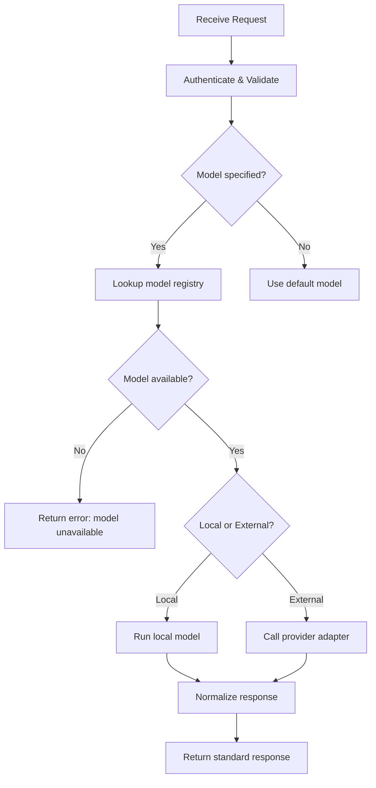
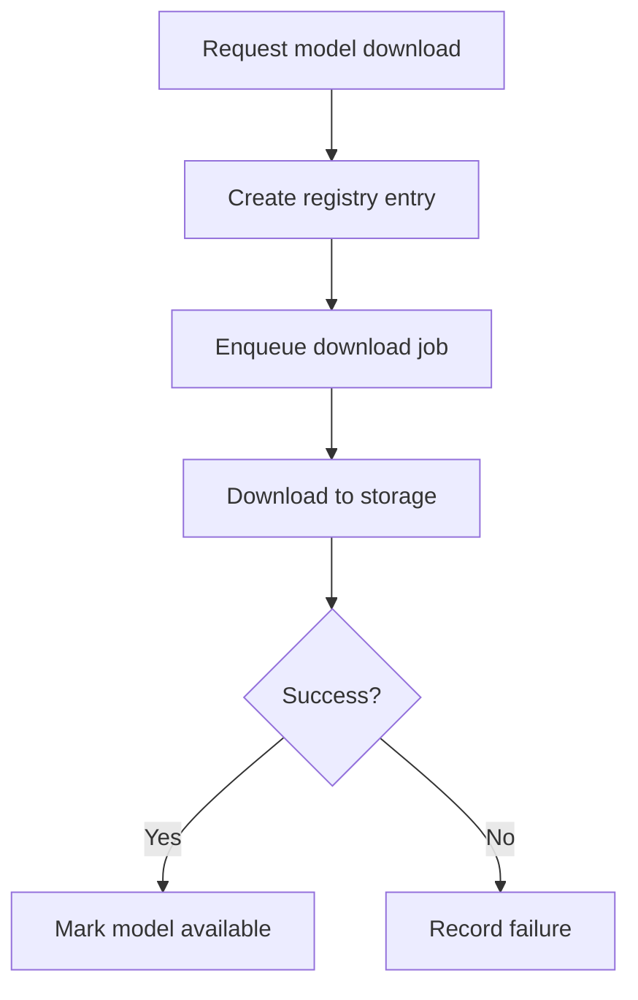
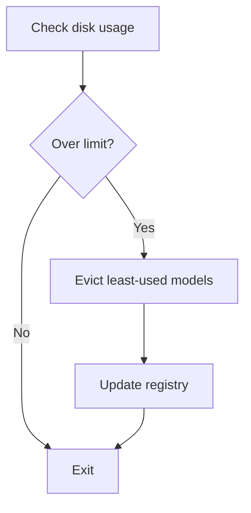

# Detailed Design — Backend Service

**Project**: Pluggably LLM API Gateway
**Component**: Backend Service
**Date**: January 24, 2026
**Status**: Approved

## Overview
This document details module responsibilities, data structures, and key flows for the backend service.

## Component Responsibilities
- **API Layer**: HTTP endpoints, request validation, response normalization
- **Auth Module**: API key/JWT auth, request context
- **Router**: Backend/model selection, fallback strategies
- **Provider Adapters**: External API normalization
- **Local Runner**: Local inference execution
- **Registry**: Model metadata, capabilities, availability
- **Download Jobs**: Async model downloads, progress tracking
- **Storage Manager**: Cache/retention, disk usage enforcement
- **Observability**: Logs, metrics

## Data Structures (Schema Sketch)

### Model Registry Entry
```yaml
id: string
name: string
version: string
modality: [text|image|3d]
capabilities:
  max_context_tokens: integer
  output_formats: [string]
  hardware_requirements: [cpu|gpu|cuda_version]
source:
  type: [huggingface|url|local]
  uri: string
size_bytes: integer
status: [available|downloading|failed|disabled]
created_at: datetime
updated_at: datetime
```

### Model Download Job
```yaml
job_id: string
model_id: string
status: [queued|running|completed|failed|cancelled]
progress_pct: number
error: string
created_at: datetime
updated_at: datetime
```

### Model Download Request
```yaml
model:
  name: string
  version: string
  modality: [text|image|3d]
source:
  type: [huggingface|url|local]
  id: string        # e.g., "deepseek-ai/DeepSeek-R1" (when type=huggingface)
  uri: string       # direct URL or local path (when type=url|local)
options:
  revision: string
  sha256: string
  allow_large: boolean
```

### Standard Request (Text/Image/3D)
```yaml
request_id: string
model: string
modality: [text|image|3d]
input:
  prompt: string
  images: [base64]
  mesh: string
parameters:
  temperature: number
  max_tokens: integer
  format: string
```

### Standard Response
```yaml
request_id: string
model: string
modality: [text|image|3d]
output:
  text: string
  images: [base64]
  mesh: string
usage:
  prompt_tokens: integer
  completion_tokens: integer
  total_tokens: integer
```

### Response Delivery Options
- **Inline (default for small payloads)**: return base64-encoded `images[]` or `mesh` directly in the JSON response.
- **Artifact URL (recommended for large payloads)**: store outputs in a temporary artifact store and return signed URLs in the response (with expiry).

**Artifact Response Example**
```yaml
output:
  artifacts:
    - type: image
      url: https://host/artifacts/{id}
      expires_at: datetime
    - type: mesh
      url: https://host/artifacts/{id}
      expires_at: datetime
```

## Flowcharts (Mermaid)

### Request Routing Flow


### Model Download Flow


### Storage Cleanup Flow


## Error Handling Strategy
- Standard error envelope with code, message, and details
- Map provider errors to internal error codes
- Return validation errors for missing fields or unsupported modalities

## Auth Strategy (Draft)
- API key authentication (required)
- JWT/OAuth optional (configurable)
- Local-only mode for home server (optional)

## Configuration Schema
Configuration is loaded via Pydantic Settings from environment variables and an optional YAML file. Environment variables override file values.

### Environment Variables
| Variable | Type | Default | Description |
|---|---|---|---|
| `LLM_API_PORT` | int | 8080 | HTTP listen port |
| `LLM_API_HOST` | str | 0.0.0.0 | HTTP bind address |
| `LLM_API_LOG_LEVEL` | str | INFO | Logging level (DEBUG, INFO, WARN, ERROR) |
| `LLM_API_CONFIG_FILE` | str | config.yaml | Path to YAML config file |
| `LLM_API_MODEL_PATH` | str | ./models | Base path for model storage |
| `LLM_API_MAX_DISK_GB` | float | 100.0 | Maximum disk usage for models (GB) |
| `LLM_API_API_KEY` | str | (required) | API key for authentication |
| `LLM_API_JWT_SECRET` | str | (optional) | JWT signing secret (if OAuth enabled) |
| `LLM_API_ARTIFACT_STORE` | str | local | Artifact store type: local, s3 |
| `LLM_API_ARTIFACT_BUCKET` | str | (optional) | S3 bucket for artifacts (if s3) |
| `LLM_API_ARTIFACT_EXPIRY_SECS` | int | 3600 | Artifact URL expiry in seconds |
| `LLM_API_PERSIST_STATE` | bool | false | Persist registry/jobs to disk |
| `LLM_API_OPENAI_API_KEY` | str | (optional) | OpenAI API key |
| `LLM_API_OPENAI_BASE_URL` | str | https://api.openai.com/v1 | OpenAI base URL |
| `LLM_API_ANTHROPIC_API_KEY` | str | (optional) | Anthropic API key |
| `LLM_API_GOOGLE_API_KEY` | str | (optional) | Google Gemini API key |
| `LLM_API_AZURE_OPENAI_API_KEY` | str | (optional) | Azure OpenAI API key |
| `LLM_API_AZURE_OPENAI_ENDPOINT` | str | (optional) | Azure OpenAI endpoint URL |
| `LLM_API_AZURE_OPENAI_API_VERSION` | str | 2024-02-15-preview | Azure OpenAI API version |
| `LLM_API_XAI_API_KEY` | str | (optional) | xAI API key |
| `LLM_API_XAI_BASE_URL` | str | https://api.x.ai/v1 | xAI base URL |
| `LLM_API_LOCAL_TEXT_MODEL_PATH` | str | (optional) | Path to local GGUF model for llama.cpp |
| `LLM_API_LOCAL_IMAGE_MODEL_ID` | str | stabilityai/sd-turbo | Diffusers model ID for images |
| `LLM_API_LOCAL_3D_MODEL_ID` | str | shap-e | Shap-E model ID |

### YAML Configuration File
```yaml
server:
  host: "0.0.0.0"
  port: 8080
  log_level: "INFO"

storage:
  model_path: "./models"
  max_disk_gb: 100.0

auth:
  api_key: "your-api-key"
  jwt_secret: null        # Optional
  local_only: false       # Skip auth for localhost

artifacts:
  store: "local"          # local | s3
  bucket: null            # Required if store=s3
  expiry_secs: 3600

persistence:
  enabled: false

local:
  text_model_path: "./models/llama.gguf"
  image_model_id: "stabilityai/sd-turbo"
  model_3d_id: "shap-e"


providers:
  openai:
    api_key: "${OPENAI_API_KEY}"
    base_url: "https://api.openai.com/v1"
  anthropic:
    api_key: "${ANTHROPIC_API_KEY}"
  google:
    api_key: "${GOOGLE_API_KEY}"
  azure:
    api_key: "${AZURE_OPENAI_API_KEY}"
    endpoint: "https://<resource>.openai.azure.com"
    api_version: "2024-02-15-preview"
  xai:
    api_key: "${XAI_API_KEY}"
    base_url: "https://api.x.ai/v1"
  huggingface:
    token: "${HF_TOKEN}"

defaults:
  model: "gpt-4"
  max_tokens: 4096
  temperature: 0.7
```

### Pydantic Settings Class (Sketch)
```python
class Settings(BaseSettings):
    host: str = "0.0.0.0"
    port: int = 8080
    log_level: str = "INFO"
    model_path: Path = Path("./models")
    max_disk_gb: float = 100.0
    api_key: str  # Required
    jwt_secret: str | None = None
    artifact_store: Literal["local", "s3"] = "local"
    artifact_bucket: str | None = None
    artifact_expiry_secs: int = 3600
    persist_state: bool = False

    openai_api_key: str | None = None
    openai_base_url: str = "https://api.openai.com/v1"
    anthropic_api_key: str | None = None

    model_config = SettingsConfigDict(
        env_prefix="LLM_API_",
        env_file=".env",
    )
```

## Observability
- Request ID propagation
- Structured logs with latency, model, backend
- Metrics: request count, error count, p95 latency

## Traceability
Requirements → Design

| Requirement ID | Design Section | Notes |
|---|---|---|
| SYS-REQ-001 | Standard Request/Response, Routing Flow | |
| SYS-REQ-006 | Configuration Schema | |
| SYS-REQ-010 | Model Registry Entry, Download Flow | |
| SYS-REQ-012 | Storage Cleanup Flow | |
| SYS-REQ-014 | Auth Strategy | |
| SYS-REQ-015 | Registry Entry + Catalog Endpoint (via Registry) | |
| SYS-REQ-016 | Response Delivery Options, Artifact Response | |
| SYS-REQ-017 | Standard Response (streaming via SSE) | |

## Definition of Ready / Done
**Ready**
- Flows defined for core operations.
- Data schemas drafted.

**Done**
- Reviewed and aligned with software architecture.
- Traceability updated.
