# Detailed Design — Backend Service

**Project**: Pluggably LLM API Gateway + PlugAI Frontend
**Component**: Backend Service
**Date**: January 26, 2026
**Status**: Updated (Pending Approval)

## Overview
This document details module responsibilities, data structures, and key flows for the backend service.

## Component Responsibilities
- **API Layer**: HTTP endpoints, request validation, response normalization
- **Auth Module**: API key/JWT auth, request context
- **Router**: Backend/model selection, fallback strategies
- **Provider Adapters**: External API normalization
- **Local Runner**: Local inference execution
- **Registry**: Model metadata, capabilities, availability
- **Key Manager**: Per-user provider and OSS key storage
- **Download Jobs**: Async model downloads, progress tracking
- **Storage Manager**: Cache/retention, disk usage enforcement
- **Observability**: Logs, metrics

## CR-003 — Auto Model Selection (Proposed)
**Goal**: Allow requests to omit `model` (or specify `model: "auto"`) and have the router pick a suitable model using a deterministic rule set.

### Selection Rules (Initial)
1. If `input.images` exists → select default image model.
2. If `input.mesh` exists → select default 3D model.
3. Else → select default text model.
4. If default for the modality is unavailable → select the first available model for that modality.
5. If no models exist for the detected modality → return a clear error with guidance.

### Router Flow (Mermaid)
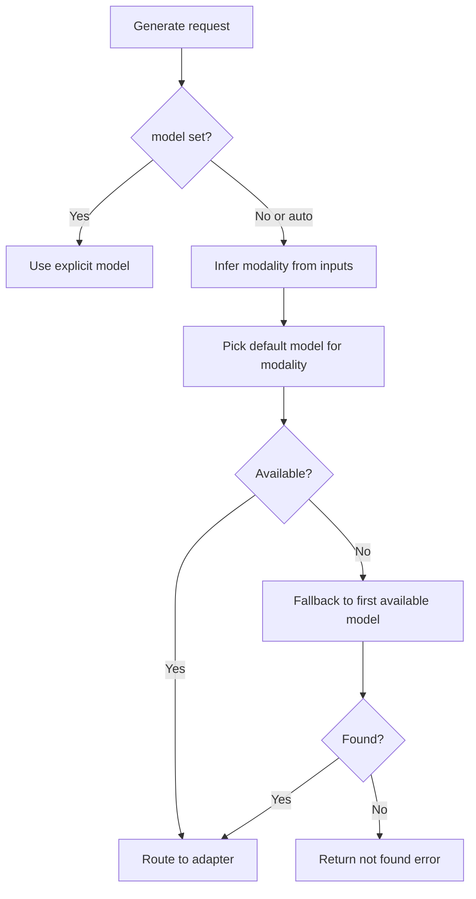

### Error Handling
- If no models are available for the inferred modality, return a `model_not_found` style error with a hint to download/register a model.

## Data Structures (Schema Sketch)

### Model Registry Entry
```yaml
id: string
name: string
version: string
modality: [text|image|3d]
capabilities:
  max_context_tokens: integer
  output_formats: [string]
  hardware_requirements: [cpu|gpu|cuda_version]
source:
  type: [huggingface|url|local]
  uri: string
size_bytes: integer
status: [available|downloading|failed|disabled]
created_at: datetime
updated_at: datetime
```

### Model Schema Entry
```yaml
id: string
model_id: string
schema_version: string
schema_json: object
created_at: datetime
updated_at: datetime
```

### Model Documentation Entry
```yaml
id: string
model_id: string
source: huggingface
summary: string
usage: string
parameters: object
tags: [string]
updated_at: datetime
```

### Hugging Face Search Result
```yaml
id: string             # e.g., "deepseek-ai/DeepSeek-R1"
name: string
tags: [string]
modality_hints: [text|image|3d]
downloads: integer
last_modified: datetime
```

### Model Download Job
```yaml
job_id: string
model_id: string
status: [queued|running|completed|failed|cancelled]
progress_pct: number
error: string
created_at: datetime
updated_at: datetime
```

### Model Status
```yaml
model_id: string
download_status: [downloading|ready|failed]
runtime_status: [unloaded|loading|loaded|busy]
queue_depth: integer
memory_usage_bytes: integer
loaded_at: datetime
last_used_at: datetime
updated_at: datetime
```

### Model Lifecycle Config
```yaml
idle_timeout_seconds: integer     # Unload after idle (0 = never)
max_loaded_models: integer        # LRU eviction threshold
pinned_models: [string]           # Never unload these model IDs
default_model_text: string        # Always loaded text model
default_model_image: string       # Always loaded image model
default_model_3d: string          # Always loaded 3D model
fallback_chains:
  model_id:
    - fallback_model_1
    - fallback_model_2
```

### Request Queue Entry
```yaml
request_id: string
user_id: string
model_id: string
position: integer
estimated_wait_seconds: integer
created_at: datetime
status: [queued|processing|completed|cancelled]
```

### Model Download Request
```yaml
model:
  name: string
  version: string
  modality: [text|image|3d]
source:
  type: [huggingface|url|local]
  id: string        # e.g., "deepseek-ai/DeepSeek-R1" (when type=huggingface)
  uri: string       # direct URL or local path (when type=url|local)
options:
  revision: string
  sha256: string
  allow_large: boolean
```

### Provider Credential
```yaml
id: string
user_id: string
provider: string
credential_type: [api_key|endpoint_key|oauth_token|service_account]
encrypted_payload: string
created_at: datetime
updated_at: datetime
```

**Provider Credential Map (initial)**
- **openai**: api_key
- **anthropic**: api_key
- **google**: api_key
- **xai**: api_key
- **azure**: endpoint_key (endpoint + api_key)
- **huggingface**: api_key (token)

### Session Summary
```yaml
id: string
title: string|null
created_at: datetime
last_used_at: datetime
```

### Session Message
```yaml
id: string
role: user|assistant
content: string
created_at: datetime
```

### Standard Request (Text/Image/3D)
```yaml
request_id: string
model: string
modality: [text|image|3d]  # Optional - inferred from model if not specified
input:
  prompt: string
  images: [base64]
  mesh: string
parameters:
  temperature: number
  max_tokens: integer
  format: string
session_id: string
state_tokens: object  # provider/model-specific state passthrough
stream: boolean  # Request streaming response (SSE) - only effective for text models
```

**Modality Inference**: When a model is specified, the backend uses the model's registered modality for processing. Clients do not need to specify the modality explicitly.

**Streaming Behavior**: The `stream` parameter requests SSE streaming, but is only honored for text generation. For image and 3D modalities, the stream flag is ignored and a standard JSON response is returned. This allows clients to use a single code path without needing to know model modalities.

### Standard Response
```yaml
request_id: string
model: string
modality: [text|image|3d]
output:
  text: string
  images: [base64]
  mesh: string
usage:
  prompt_tokens: integer
  completion_tokens: integer
  total_tokens: integer
session_id: string
state_tokens: object
```

### User Provider Key
```yaml
id: string
user_id: string
provider: string
label: string
encrypted_key: string
created_at: datetime
updated_at: datetime
```

### OSS Access Key
```yaml
id: string
user_id: string
label: string
hashed_key: string
status: [active|revoked]
created_at: datetime
updated_at: datetime
```

### User Profile
```yaml
id: string
email: string
password_hash: string
status: [active|disabled]
created_at: datetime
updated_at: datetime
preferences: object
```

### Invite Token
```yaml
id: string
token: string
created_by: string
expires_at: datetime
used_by: string
used_at: datetime
```

### User API Token
```yaml
id: string
user_id: string
label: string
hashed_token: string
status: [active|revoked]
created_at: datetime
revoked_at: datetime
```

### Response Delivery Options
- **Inline (default for small payloads)**: return base64-encoded `images[]` or `mesh` directly in the JSON response.
- **Artifact URL (recommended for large payloads)**: store outputs in a temporary artifact store and return signed URLs in the response (with expiry).

**Artifact Response Example**
```yaml
output:
  artifacts:
    - type: image
      url: https://host/artifacts/{id}
      expires_at: datetime
    - type: mesh
      url: https://host/artifacts/{id}
      expires_at: datetime
```

## Flowcharts (Mermaid)

### Request Routing Flow
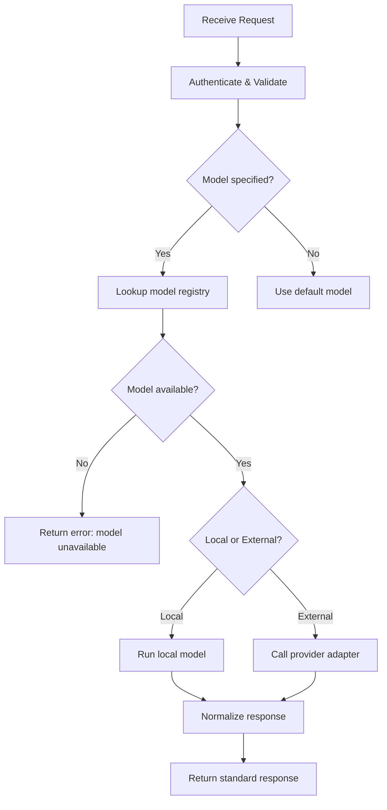

### Model Download Flow
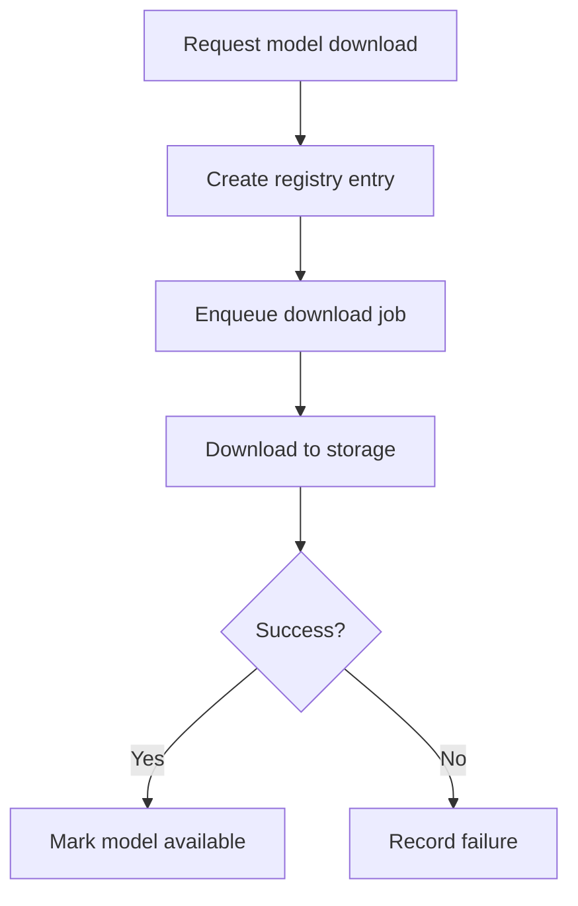

### Hugging Face Search Flow
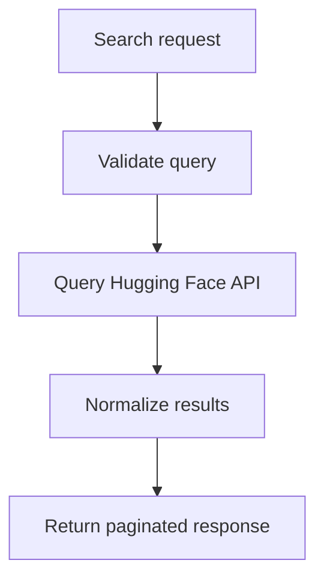

### Session Naming Flow
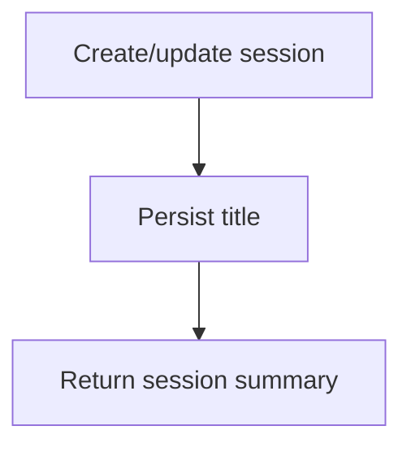

### Health Check Flow
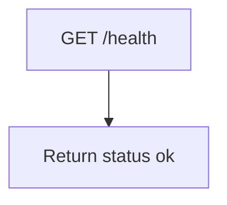

### Download Deduplication Flow
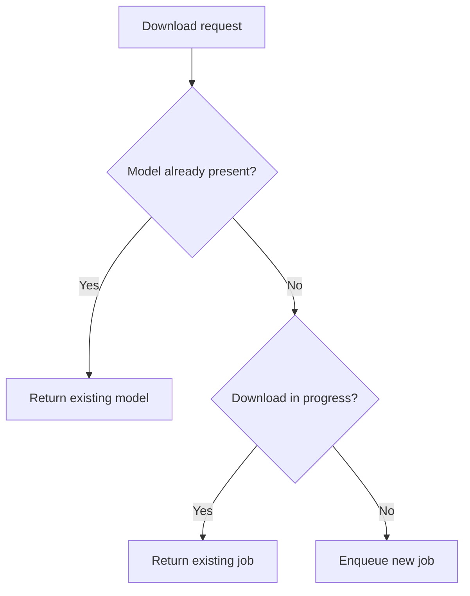

### Model Lifecycle Flow
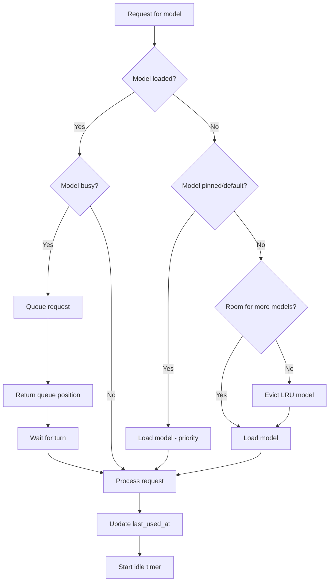

### Model Load/Unload Flow
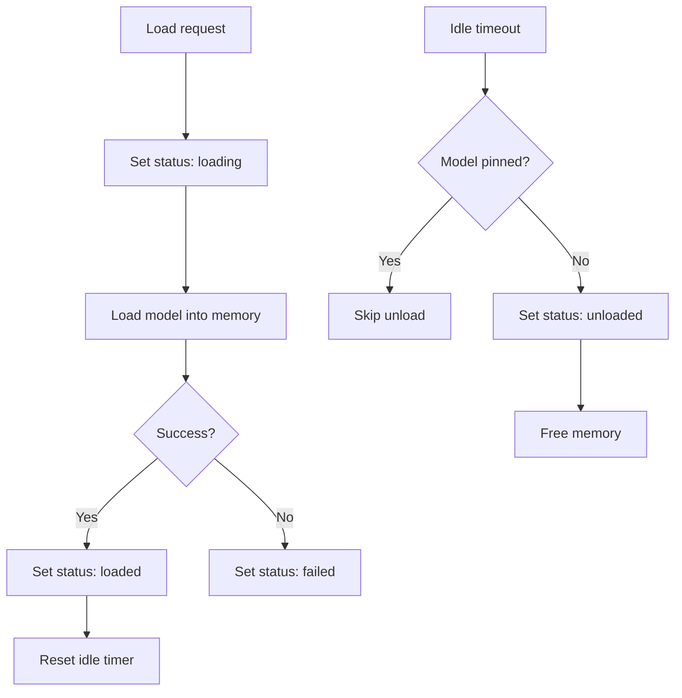

### Request Cancellation Flow
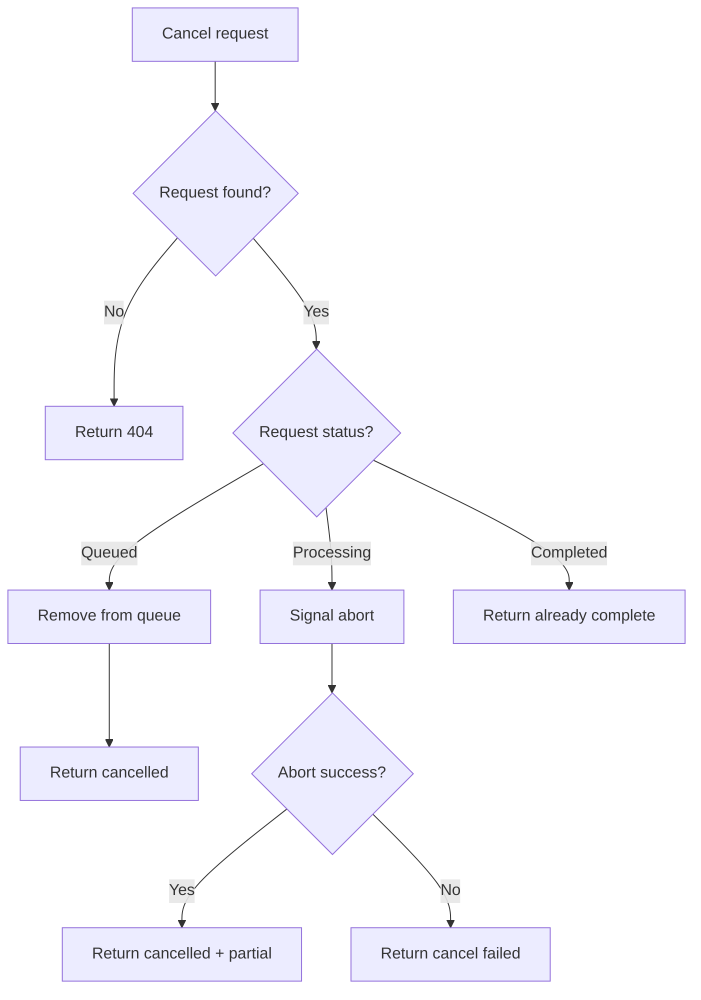

### Fallback Chain Flow
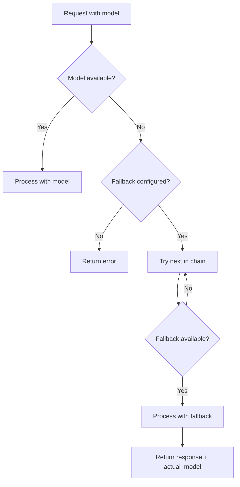

### Metadata Enrichment Flow
  ```mermaid
  flowchart TD
    A[Register HF model] --> B[Fetch HF model card/metadata]
    B --> C{Fetch success?}
    C -->|Yes| D[Parse docs + parameters]
    C -->|No| E[Proceed without docs]
    D --> F[Store in registry DB]
    E --> F
  ```

### Startup Model Discovery Flow
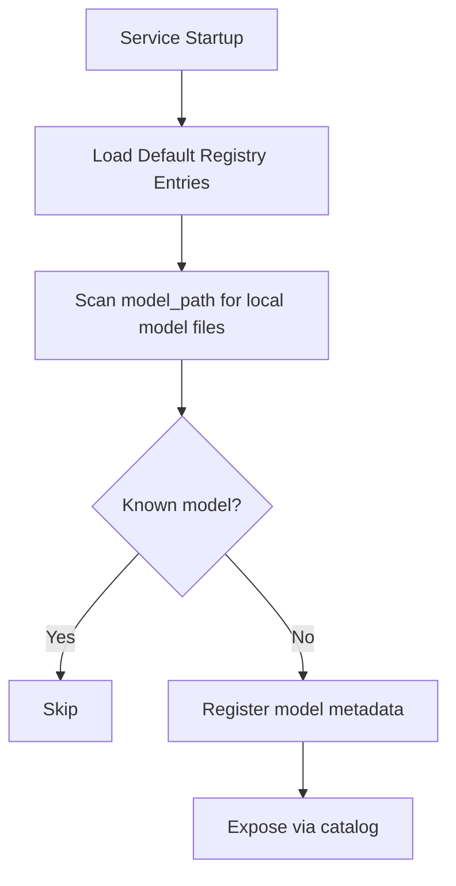

### Session Lifecycle Flow
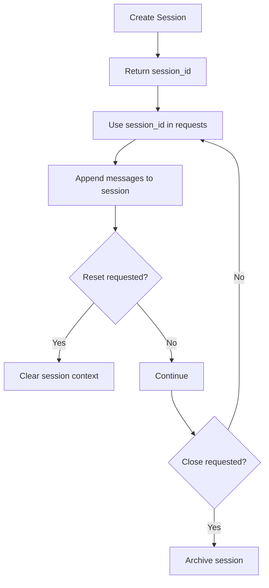

### Storage Cleanup Flow
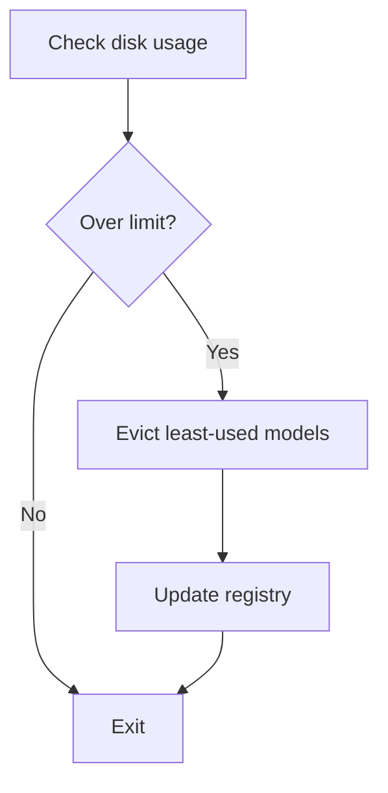

  ### User Key Management Flow
  ```mermaid
  flowchart TD
    A[User submits key] --> B[Authenticate user]
    B --> C[Encrypt or hash key]
    C --> D[Store in SQLite]
    D --> E[Return key metadata]
  ```

  ### Invite-Only Registration Flow
  ```mermaid
  flowchart TD
    A[Register request] --> B[Validate invite token]
    B --> C{Valid?}
    C -->|No| D[Reject]
    C -->|Yes| E[Create user + consume invite]
  ```

  ### User API Token Flow
  ```mermaid
  flowchart TD
    A[Create token] --> B[Generate token]
    B --> C[Hash token]
    C --> D[Store in SQLite]
    D --> E[Return token once]
  ```

## Error Handling Strategy
- Standard error envelope with code, message, and details
- Map provider errors to internal error codes
- Return validation errors for missing fields or unsupported modalities

## Session Strategy
- Store session metadata (id, created_at, last_used_at, status) and message history.
- Allow session-scoped generation for text, image, and 3D requests.
- Provide reset and close operations that affect subsequent context retrieval.
- Support optional `state_tokens` passthrough for iterative updates (e.g., image refinement tokens).
- **Session state is persisted independently of model process lifecycle**: sessions survive model spindown/unload and can be resumed seamlessly after model reload.

## Model Discovery Strategy
- Scan the configured `model_path` on startup for supported local model formats (e.g., `.gguf`, `.safetensors`).
- Derive `id`, `name`, `version/quantization`, `size_bytes`, and `local_path` from filenames.
- Do not overwrite explicit registry entries already in the database.
- Mark discovered models as `available` and include capabilities defaults (context size, output formats, hardware hints).

## Model Registry Persistence
- Model metadata is persisted in the SQLite database (`models` table).
- The `ModelRegistry` class uses SQLAlchemy for all CRUD operations.
- Downloaded models store their source information (`source_type`, `source_uri`) to preserve the original HuggingFace repo ID or URL.
- Auto-discovered local files are registered with their filename as the ID unless already present in the database.
- See ADR-005 for migration details from JSON-based persistence.

## Parameter Documentation Strategy
- Provide a read-only schema endpoint that returns parameter descriptions, defaults, and examples.
- Keep schema aligned with OpenAPI definitions and request validators.
- Include model-selection guidance (provider:model, pattern detection) in the schema response.
- Populate parameter docs from stored model documentation when available.

## Auth Strategy (Draft)
- API key authentication (required)
- JWT/OAuth optional (configurable)
- Local-only mode for home server (optional)
- User-scoped provider keys are stored encrypted; OSS keys stored as hashed tokens.
- User credentials stored as salted password hashes; invite tokens are single-use.
- User API tokens are stored hashed and are revocable.

## Configuration Schema
Configuration is loaded via Pydantic Settings from environment variables and an optional YAML file. Environment variables override file values.

### Environment Variables
| Variable | Type | Default | Description |
|---|---|---|---|
| `LLM_API_PORT` | int | 8080 | HTTP listen port |
| `LLM_API_HOST` | str | 0.0.0.0 | HTTP bind address |
| `LLM_API_LOG_LEVEL` | str | INFO | Logging level (DEBUG, INFO, WARN, ERROR) |
| `LLM_API_CONFIG_FILE` | str | config.yaml | Path to YAML config file |
| `LLM_API_MODEL_PATH` | str | ./models | Base path for model storage |
| `LLM_API_MAX_DISK_GB` | float | 100.0 | Maximum disk usage for models (GB) |
| `LLM_API_API_KEY` | str | (required) | API key for authentication |
| `LLM_API_JWT_SECRET` | str | (optional) | JWT signing secret (if OAuth enabled) |
| `LLM_API_ARTIFACT_STORE` | str | local | Artifact store type: local, s3 |
| `LLM_API_ARTIFACT_BUCKET` | str | (optional) | S3 bucket for artifacts (if s3) |
| `LLM_API_ARTIFACT_EXPIRY_SECS` | int | 3600 | Artifact URL expiry in seconds |
| `LLM_API_PERSIST_STATE` | bool | false | Persist job state to disk (model registry always uses database) |
| `LLM_API_DB_PATH` | str | ./data/plugai.sqlite | SQLite database path |
| `LLM_API_REQUIRE_INVITE` | bool | true | Require invite token for registration |
| `LLM_API_OPENAI_API_KEY` | str | (optional) | OpenAI API key |
| `LLM_API_OPENAI_BASE_URL` | str | https://api.openai.com/v1 | OpenAI base URL |
| `LLM_API_ANTHROPIC_API_KEY` | str | (optional) | Anthropic API key |
| `LLM_API_GOOGLE_API_KEY` | str | (optional) | Google Gemini API key |
| `LLM_API_AZURE_OPENAI_API_KEY` | str | (optional) | Azure OpenAI API key |
| `LLM_API_AZURE_OPENAI_ENDPOINT` | str | (optional) | Azure OpenAI endpoint URL |
| `LLM_API_AZURE_OPENAI_API_VERSION` | str | 2024-02-15-preview | Azure OpenAI API version |
| `LLM_API_XAI_API_KEY` | str | (optional) | xAI API key |
| `LLM_API_XAI_BASE_URL` | str | https://api.x.ai/v1 | xAI base URL |
| `LLM_API_LOCAL_TEXT_MODEL_PATH` | str | (optional) | Path to local GGUF model for llama.cpp |
| `LLM_API_LOCAL_IMAGE_MODEL_ID` | str | stabilityai/sd-turbo | Diffusers model ID for images |
| `LLM_API_LOCAL_3D_MODEL_ID` | str | shap-e | Shap-E model ID |
| `LLM_API_MODEL_IDLE_TIMEOUT` | int | 300 | Seconds before unloading idle model (0=never) |
| `LLM_API_MAX_LOADED_MODELS` | int | 3 | Maximum concurrent loaded models |
| `LLM_API_PINNED_MODELS` | str | (optional) | Comma-separated model IDs to never unload |
| `LLM_API_DEFAULT_TEXT_MODEL` | str | (optional) | Always-loaded default text model |
| `LLM_API_DEFAULT_IMAGE_MODEL` | str | (optional) | Always-loaded default image model |
| `LLM_API_DEFAULT_3D_MODEL` | str | (optional) | Always-loaded default 3D model |
| `LLM_API_MAX_QUEUE_DEPTH` | int | 100 | Maximum pending requests per model |
| `LLM_API_REQUEST_TIMEOUT` | int | 300 | Max seconds for a single request |

### YAML Configuration File
```yaml
server:
  host: "0.0.0.0"
  port: 8080
  log_level: "INFO"

storage:
  model_path: "./models"
  max_disk_gb: 100.0

auth:
  api_key: "your-api-key"
  jwt_secret: null        # Optional
  local_only: false       # Skip auth for localhost

artifacts:
  store: "local"          # local | s3
  bucket: null            # Required if store=s3
  expiry_secs: 3600

persistence:
  enabled: false
  db_path: "./data/plugai.sqlite"
auth:
  require_invite: true

local:
  text_model_path: "./models/llama.gguf"
  image_model_id: "stabilityai/sd-turbo"
  model_3d_id: "shap-e"


providers:
  # Commercial provider keys are user-scoped and stored via Profile → Provider Keys.
  # Server env keys are optional fallbacks for admin/testing only.
  openai:
    api_key: "${OPENAI_API_KEY}"
    base_url: "https://api.openai.com/v1"
  anthropic:
    api_key: "${ANTHROPIC_API_KEY}"
  google:
    api_key: "${GOOGLE_API_KEY}"
  azure:
    api_key: "${AZURE_OPENAI_API_KEY}"
    endpoint: "https://<resource>.openai.azure.com"
    api_version: "2024-02-15-preview"
  xai:
    api_key: "${XAI_API_KEY}"
    base_url: "https://api.x.ai/v1"
  huggingface:
    token: "${HF_TOKEN}"

defaults:
  model: "gpt-4"
  max_tokens: 4096
  temperature: 0.7

lifecycle:
  idle_timeout_seconds: 300     # Unload after 5 min idle (0 = never)
  max_loaded_models: 3          # Max concurrent models in memory
  pinned_models:                # Never unload these
    - "llama-7b-q4"
  default_models:               # Always loaded, fallback during cold-start
    text: "llama-7b-q4"
    image: "sd-turbo"
    3d: null

queue:
  max_depth: 100                # Max pending requests per model
  position_update_interval: 1   # Seconds between position updates

fallback:
  global_chain:                 # Default fallback for all models
    - "gpt-4"
    - "gpt-3.5-turbo"
  model_chains:                 # Per-model fallback overrides
    "llama-70b":
      - "llama-13b"
      - "llama-7b"
  temperature: 0.7
```

### Pydantic Settings Class (Sketch)
```python
class Settings(BaseSettings):
    host: str = "0.0.0.0"
    port: int = 8080
    log_level: str = "INFO"
    model_path: Path = Path("./models")
    max_disk_gb: float = 100.0
    api_key: str  # Required
    jwt_secret: str | None = None
    artifact_store: Literal["local", "s3"] = "local"
    artifact_bucket: str | None = None
    artifact_expiry_secs: int = 3600
    persist_state: bool = False

    openai_api_key: str | None = None
    openai_base_url: str = "https://api.openai.com/v1"
    anthropic_api_key: str | None = None

    model_config = SettingsConfigDict(
        env_prefix="LLM_API_",
        env_file=".env",
    )
```

## Observability
- Request ID propagation
- Structured logs with latency, model, backend
- Metrics: request count, error count, p95 latency

## Traceability
Requirements → Design

| Requirement ID | Design Section | Notes |
|---|---|---|
| SYS-REQ-001 | Standard Request/Response, Routing Flow | |
| SYS-REQ-006 | Configuration Schema | |
| SYS-REQ-010 | Model Registry Entry, Download Flow | |
| SYS-REQ-012 | Storage Cleanup Flow | |
| SYS-REQ-014 | Auth Strategy | |
| SYS-REQ-015 | Registry Entry + Catalog Endpoint (via Registry) | |
| SYS-REQ-016 | Response Delivery Options, Artifact Response | |
| SYS-REQ-017 | Standard Response (streaming via SSE) | |
| SYS-REQ-018 | Model Discovery Strategy, Startup Model Discovery Flow | |
| SYS-REQ-019 | Parameter Documentation Strategy | |
| SYS-REQ-020 | Session Strategy, Session Lifecycle Flow | |
| SYS-REQ-021 | Session Strategy, Session Lifecycle Flow | |
| SYS-REQ-033 | Model Registry Entry, Model Schema Entry | |
| SYS-REQ-034 | Parameter Documentation Strategy | |
| SYS-REQ-035 | User Provider Key, User Key Management Flow | |
| SYS-REQ-036 | OSS Access Key, User Key Management Flow | |
| SYS-REQ-037 | Invite Token, Invite-Only Registration Flow | |
| SYS-REQ-038 | User Profile | |
| SYS-REQ-039 | User API Token, User API Token Flow | |
| SYS-REQ-040 | Model Documentation Entry, Metadata Enrichment Flow | |
| SYS-REQ-042 | Model Download Flow | |
| SYS-REQ-043 | Model Status | |
| SYS-REQ-044 | Download Deduplication Flow | |
| SYS-REQ-045 | Model Lifecycle Config, Model Lifecycle Flow | |
| SYS-REQ-046 | Request Queue Entry, Model Lifecycle Flow | |
| SYS-REQ-047 | Request Cancellation Flow | |
| SYS-REQ-048 | Standard Request (regenerate field) | |
| SYS-REQ-049 | Model Load/Unload Flow | |
| SYS-REQ-050 | Model Status (runtime_status) | |
| SYS-REQ-051 | Model Status (loaded models list) | |
| SYS-REQ-052 | Model Lifecycle Config (default_models), Model Lifecycle Flow | |
| SYS-REQ-053 | Fallback Chain Flow, Configuration Schema | |
| SYS-REQ-063 | Hugging Face Search Result, Hugging Face Search Flow | |
| SYS-REQ-064 | Provider Credential | |
| SYS-REQ-065 | Session Summary | |
| SYS-REQ-066 | Session Naming Flow | |
| SYS-REQ-067 | Session Message | |
| SYS-REQ-068 | Health Check Flow | |

## Definition of Ready / Done
**Ready**
- Flows defined for core operations.
- Data schemas drafted.

**Done**
- Reviewed and aligned with software architecture.
- Traceability updated.
