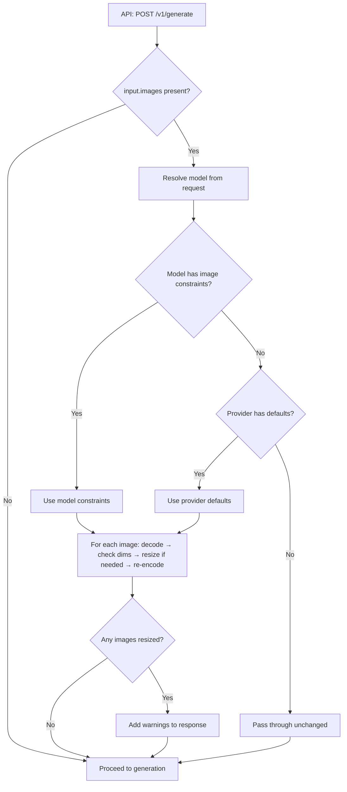
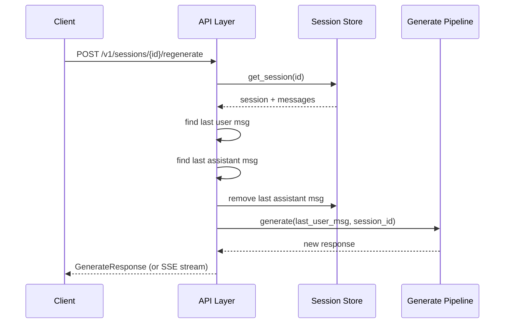

# Detailed Design — CR-002: API-First Responsibility Refactor

**Project**: Pluggably LLM API Gateway
**Date**: February 17, 2026
**Status**: Proposed (Phase 2 — Awaiting Phase 4 Approval)

## Overview

This document details the design for all seven changes in CR-002. Each section covers the component responsibilities, data structures, algorithms, and interfaces for one change.

---

## 1. Model-Driven Image Preprocessing (US-042 / SYS-REQ-071)

### Current State
- `GenerateInput.images` field exists in the API schema but is **never processed** by the backend.
- The model registry (`ModelCapabilities`) has no image constraint fields.
- The frontend resizes to a hardcoded 1024px max edge and encodes as PNG.
- No commercial adapter supports image input (vision) yet; only local runner does image *output*.

### Design

#### 1.1 Model Registry: Image Constraint Metadata

Add image input constraint fields to `ModelCapabilities` (in `registry/store.py` and `db/models.py`):

```
image_input_max_pixels: Optional[int]       # e.g. 1048576 (1024*1024) — max total pixels
image_input_max_edge: Optional[int]          # e.g. 2048 — max single dimension
image_input_formats: Optional[List[str]]     # e.g. ["png", "jpeg", "webp"]
```

**Why `max_pixels` + `max_edge`**: Some models (e.g., GPT-4 Vision) constrain by total pixel budget; others (e.g., Claude) constrain by max dimension. Both are needed.

**When all three fields are `None`**: The model has no documented image constraints → images are passed through unchanged (no arbitrary resize).

**Provider defaults** (used when model-specific values are not in the registry):

| Provider | max_pixels | max_edge | formats |
|---|---|---|---|
| openai (gpt-4o/vision) | 2,048,000 | 2048 | png, jpeg, webp, gif |
| anthropic (claude-3+) | 1,568,000 | 1568 | png, jpeg, webp, gif |
| google (gemini) | — | 3072 | png, jpeg, webp |
| local (diffusers img2img) | — | 1024 | png |

These defaults live in a `PROVIDER_IMAGE_DEFAULTS` dict in the new `image_processing` module, not hardcoded in the registry.

#### 1.2 Image Processing Module

New module: `src/llm_api/processing/images.py`

```
preprocess_images(
    images: List[str],               # base64 data-URL strings
    model_capabilities: ModelCapabilities,
    provider: Optional[str] = None,  # for provider-level defaults
) -> Tuple[List[str], List[str]]     # (processed_images, warnings)
```

**Algorithm**:
1. For each image in `images`:
   a. Decode base64 data-URL → PIL Image + detect original format
   b. Look up constraints: model-specific first, then provider defaults, then `None` (pass-through)
   c. If constraints exist:
      - Check if image exceeds `max_edge` or `max_pixels`
      - If yes: resize preserving aspect ratio to fit within constraints
      - Re-encode in preferred format (from `image_input_formats[0]`, defaulting to original format)
      - Emit warning: `"Image resized from {W}x{H} to {W'}x{H'} to fit model constraints"`
   d. If no constraints: pass through unchanged
   e. Re-encode as base64 data-URL
2. Return `(processed_images, warnings)`

**Dependencies**: `Pillow` (already a dependency for image generation)

#### 1.3 Integration Point

In `api/router.py` `generate()`, after input validation and before calling `select_backend()`:

```python
if request.input.images:
    model_caps = registry.get_capabilities(resolved_model_id)
    request.input.images, image_warnings = preprocess_images(
        request.input.images, model_caps, provider=resolved_provider
    )
    # Attach warnings to response
```

#### 1.4 Response Warnings Field

Add `warnings: Optional[List[str]]` to `GenerateResponse` schema. Populated when images were resized or other non-fatal processing occurred.

---

## 2. Session Auto-Naming on First Message (US-043 / SYS-REQ-072)

### Design

In `sessions/store.py` `append_message()`:

```python
def append_message(self, session_id: str, modality: str, input_data: dict, output_data: dict):
    with get_db_session() as db:
        db_session = db.query(DbSessionRecord).filter_by(id=session_id).first()
        if not db_session:
            raise ValueError(f"Session {session_id} not found")

        # Auto-name on first user message if no title set
        if db_session.title is None and len(db_session.messages) == 0:
            prompt_text = input_data.get("prompt", "")
            if prompt_text:
                auto_title = prompt_text.strip()[:50].strip()
                db_session.title = auto_title

        # ... existing message append logic
```

**Rules**:
- Only triggers when `title is None` AND message count is 0 (first message)
- Uses the `prompt` field from `input_data`
- Truncates to 50 characters, stripped of leading/trailing whitespace
- Does NOT overwrite existing titles (client-set titles are preserved)
- `PUT /v1/sessions/{id}` still works for manual rename

**No new endpoint, no new schema change** — this is purely internal behavior.

---

## 3. Regenerate Endpoint (US-044 / SYS-REQ-073)

### Endpoint

```
POST /v1/sessions/{session_id}/regenerate
```

### Request Body (optional)

```json
{
    "model": "optional-override-model",
    "parameters": { "temperature": 0.9 },
    "stream": true
}
```

All fields optional. If omitted, uses the same model/parameters as the original request.

### Algorithm

```
1. Load session by session_id (404 if not found)
2. Find the last user message in session history (400 if none)
3. Find the last assistant message (if any)
4. Build a GenerateRequest from:
   - prompt: last user message content
   - images: last user message images (if any)
   - model: override or original session model
   - parameters: override or original
   - session_id: same session
   - stream: from request body
5. If a last assistant message exists, remove it from session history
6. Delegate to the existing generate() flow
7. The generate flow appends the new assistant message to the session
8. Return the response (streaming or non-streaming)
```

### Implementation Location

New function in `api/router.py`:

```python
@router.post("/v1/sessions/{session_id}/regenerate")
async def regenerate(session_id: str, ...):
    ...
```

This reuses the existing generation pipeline — the regenerate endpoint is essentially "remove last assistant message + replay last user message."

### Error Cases
- 404: Session not found
- 400: No messages in session to regenerate
- 400: Last message is not from assistant (nothing to replace)

---

## 4. Absolute Artifact URLs (US-045 / SYS-REQ-074)

### Design

In `api/router.py`, when constructing `GenerateResponse`:

Currently artifact URLs are relative: `/v1/artifacts/{artifact_id}`

Change to construct absolute URLs using the request's base URL:

```python
def _absolute_artifact_url(request: Request, relative_path: str) -> str:
    base = str(request.base_url).rstrip("/")
    return f"{base}{relative_path}"
```

Apply this to:
- `image_artifact_urls` list items
- `artifact_3d_url`

**Where**: In the generate endpoint response construction, after artifacts are stored.

**No new schema fields** — same `image_artifact_urls` and `artifact_3d_url` fields, just absolute instead of relative.

---

## 5. Session Message Count (US-046 / SYS-REQ-075)

### Design

Add `message_count: int` to session API response models:
- `SessionSummary` (used in list endpoints)
- `SessionDetail` (used in get endpoint)

In `sessions/store.py`:
- `list_sessions()`: Include message count in each returned session (already fetched from DB)
- `get_session()`: Include message count (already available from `len(session.messages)`)

The count is derived from `len(db_session.messages)` at query time — no new stored field needed.

### Schema Change

```python
class SessionSummary(BaseModel):
    id: str
    title: Optional[str]
    created_at: datetime
    last_used_at: Optional[datetime]
    message_count: int  # NEW
```

---

## 6. Dart Client Consolidation (US-CL-010 / SYS-REQ-076)

### Current State

Two client files:
- `clients/dart/lib/api_client.dart` → `LlmApiClient` (primary, used by frontend)
- `clients/dart/lib/pluggably_client.dart` → `PluggablyClient` (legacy, mostly dead code)

The frontend imports `pluggably_client.dart` only for `ApiError` in one catch block.

### Design

1. **Verify `ApiError` exists in `api_client.dart`**: Check if the main client already defines `ApiError`. If not, move it there.
2. **Remove `pluggably_client.dart`**: Delete the file.
3. **Update `sdk.dart` barrel**: Ensure it exports everything needed.
4. **Update frontend imports**: Change `import 'package:pluggably_llm_client/pluggably_client.dart'` to `import 'package:pluggably_llm_client/sdk.dart'` wherever used.
5. **Add `regenerate()` method** to `LlmApiClient` (see next section).

---

## 7. Client Regenerate Helper (US-CL-011 / SYS-REQ-073)

### Dart Client

```dart
/// Regenerate the last assistant response in a session.
/// Returns a [GenerationResponse] for non-streaming, or use
/// [regenerateStream] for SSE streaming.
Future<GenerationResponse> regenerate(
    String sessionId, {
    String? model,
    Map<String, dynamic>? parameters,
}) async {
    final body = <String, dynamic>{};
    if (model != null) body['model'] = model;
    if (parameters != null) body['parameters'] = parameters;
    final json = await _post('/v1/sessions/$sessionId/regenerate', body: body);
    return GenerationResponse.fromJson(json);
}

/// Streaming variant of regenerate.
Stream<GenerationStreamEvent> regenerateStream(
    String sessionId, {
    String? model,
    Map<String, dynamic>? parameters,
}) {
    final body = <String, dynamic>{'stream': true};
    if (model != null) body['model'] = model;
    if (parameters != null) body['parameters'] = parameters;
    return _postSSE('/v1/sessions/$sessionId/regenerate', body: body);
}
```

---

## 8. Frontend Cleanup (US-FE-020)

### Changes to `chat_page.dart`

| Current Logic | Action | Replacement |
|---|---|---|
| `_autoNameSession()` — truncates prompt, calls `updateSession()` | **Remove** | Backend auto-names on first message |
| Image preprocessing pipeline (`_processImage`, resize to 1024, PNG encode) | **Remove** | Send raw image data; backend preprocesses per model |
| `_regenerate()` — finds last user msg, removes last assistant msg, resends | **Replace** | Call `client.regenerateStream(sessionId)` |
| Artifact URL prefixing (`${client.baseUrl}$url`) | **Remove** | Backend returns absolute URLs |
| `import 'package:pluggably_llm_client/pluggably_client.dart'` | **Replace** | Import from consolidated `sdk.dart` |

### What stays in the frontend
- Image capture (upload, paste, URL fetch) — these are UI actions
- Base64 encoding of captured images — transport encoding
- Display logic, layout selection, model filtering — presentation

---

## Interface Contract Updates

### New Endpoint: `POST /v1/sessions/{session_id}/regenerate`

**Request**:
```json
{
    "model": "string (optional)",
    "parameters": "object (optional)",
    "stream": "boolean (optional, default false)"
}
```

**Response** (non-streaming): Same as `POST /v1/generate` response.

**Response** (streaming): Same SSE event format as `/v1/generate` with `stream: true`.

**Errors**:
- 404: Session not found
- 400: No messages to regenerate

### Updated Response: `GenerateResponse`

New optional field:
```json
{
    "warnings": ["Image resized from 4096x4096 to 1024x1024 to fit model constraints"]
}
```

### Updated Response: `SessionSummary` / `SessionDetail`

New field:
```json
{
    "message_count": 4
}
```

### Updated Response: Artifact URLs

Before: `"/v1/artifacts/abc123"`
After: `"http://localhost:8080/v1/artifacts/abc123"`

---

## Data Flow Diagram: Image Preprocessing



## Sequence Diagram: Regenerate Flow



---

## Traceability

| Requirement ID | Design Section | Notes |
|---|---|---|
| SYS-REQ-071 | §1 Image Preprocessing | Model-driven resize |
| SYS-REQ-072 | §2 Session Auto-Naming | First message trigger |
| SYS-REQ-073 | §3 Regenerate Endpoint, §7 Client Helper | Backend + client |
| SYS-REQ-074 | §4 Absolute Artifact URLs | Request-aware URL construction |
| SYS-REQ-075 | §5 Session Message Count | Derived field |
| SYS-REQ-076 | §6 Client Consolidation | Remove legacy client |
| SYS-REQ-048 | §3 Regenerate Endpoint | Now a proper endpoint |
| SYS-REQ-070 | §1 Image Preprocessing | Extended with preprocessing |

## Definition of Ready / Done

**Ready**: All data structures, algorithms, and interfaces defined. Traceability complete.

**Done**: Implementation matches this design. Tests pass. Frontend cleaned up.
