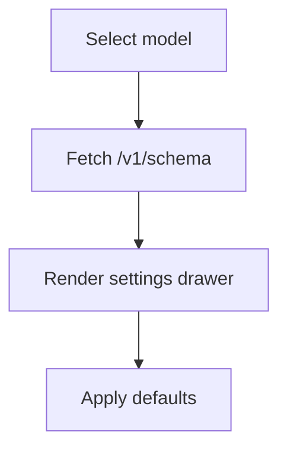
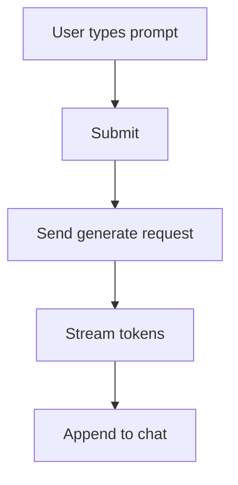
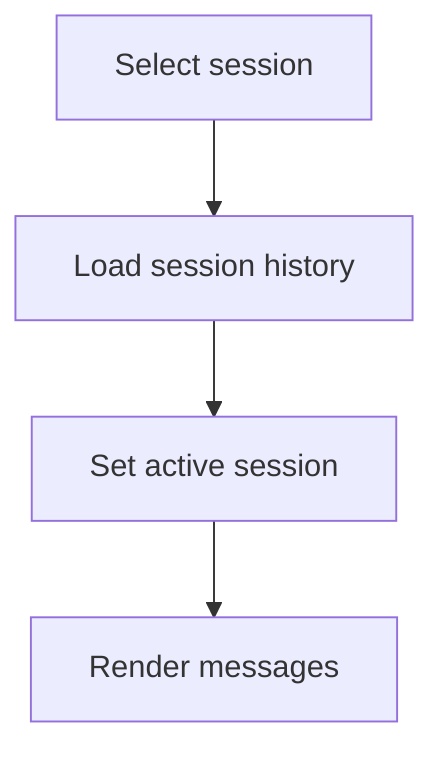

# Detailed Design — PlugAI Frontend

**Project**: Pluggably LLM API Gateway + PlugAI Frontend
**Component**: Frontend (Flutter Web/Mobile)
**Date**: January 26, 2026
**Status**: Updated (Pending Approval)

## Overview
This document describes UI structure, state management, data flow, and schema-driven parameter rendering for the PlugAI frontend.

## Component Responsibilities
- **App Shell**: Routing, theme, layout responsive to screen size
- **Model Catalog**: Load models, filter by modality, select active model
- **Settings Drawer**: Render parameter forms from schema, validate inputs
- **Chat UI**: Streamed text responses, markdown rendering, message history
- **Image UI**: Gallery grid, preview, download
- **3D UI**: 3D viewer, interaction controls, download
- **Session UI**: Create, list, switch sessions
- **Key Management UI**: Provider keys and OSS key workflows
- **Auth UI**: Invite-only registration, login/logout
- **Profile UI**: Preferences (preferred models, defaults)
- **API Tokens UI**: Create and revoke personal API tokens
- **Layout Controller**: Auto-switch layouts by modality/device with user override

## Implementation Notes (Current)
- Implemented screens: Models, Chat, Sessions, Settings, Profile, Tokens, Keys, Login/Register.
- Chat supports streaming, cancel, and regenerate actions.
- Settings drawer renders schema-driven fields (string/number/boolean/enum/slider).
- Image and 3D UIs are pending (placeholders in requirements).
- Layout auto-switch/lock is not yet implemented beyond responsive breakpoints.
- Frontend uses the shared Dart client package (`clients/dart`) for API calls.

## State Model (Sketch)
```yaml
app_state:
  base_url: string
  api_key: string
  selected_model_id: string
  selected_modality: text|image|3d
  schema:
    version: string
    params: object
  parameters: object
  sessions:
    active_id: string
    items: [SessionSummary]
  messages: [Message]
  images: [ImageResult]
  models: [ModelSummary]
  user:
    id: string
    email: string
    preferences: object
  tokens: [UserToken]
  layout:
    mode: auto|locked|manual
    selected: chat|studio|compact
```

### Message
```yaml
id: string
role: user|assistant
content: string
created_at: datetime
```

### ImageResult
```yaml
id: string
url: string
created_at: datetime
```

### SessionSummary
```yaml
id: string
title: string
last_used_at: datetime
```

## Schema-Driven Parameter Rendering
- Supported field types: string, number, integer, boolean, enum, slider(range)
- Map schema to UI controls:
  - string → text input
  - number/int → numeric input
  - boolean → switch
  - enum → dropdown
  - range → slider
- Validation performed on change and submit

## Flowcharts (Mermaid)

### Model Selection & Schema Load


### Chat Send Flow


### Session Switch Flow


  ### User API Token Flow
  ```mermaid
  flowchart TD
    A[Create token] --> B[Show token once]
    B --> C[Store token metadata]
    C --> D[Revoke token]
  ```

  ### Invite-Only Registration Flow
  ```mermaid
  flowchart TD
    A[Enter invite token + email/password] --> B[Register]
    B --> C{Invite valid?}
    C -->|No| D[Show error]
    C -->|Yes| E[Create account]
  ```

  ### Layout Selection Flow
  ```mermaid
  flowchart TD
    A[Detect modality/device] --> B{Mode?}
    B -->|Auto| C[Select chat/studio/compact]
    B -->|Locked| D[Use locked layout]
    B -->|Manual| E[User selects layout]
    C --> F[Persist preference]
    D --> F
    E --> F
  ```

## UI Layout
- **Desktop**: three-column layout (models | chat/gallery | settings)
- **Tablet**: two-column (models + main content) with slide-in settings
- **Mobile**: single column; settings as bottom sheet

## Error Handling
- Inline parameter validation messages
- Global error banner for network/auth failures
- Retry for transient errors (timeout)

## Traceability
Requirements → Design

| Requirement ID | Design Section | Notes |
|---|---|---|
| SYS-REQ-025 | Component Responsibilities, UI Layout | |
| SYS-REQ-026 | Model Selection & Schema Load | |
| SYS-REQ-027 | Schema-Driven Parameter Rendering | |
| SYS-REQ-028 | Chat Send Flow | |
| SYS-REQ-029 | Image UI | |
| SYS-REQ-030 | 3D UI | |
| SYS-REQ-031 | State Model (base_url) | |
| SYS-REQ-032 | Session Switch Flow | |
| SYS-REQ-035 | Key Management UI | |
| SYS-REQ-036 | Key Management UI | |
| SYS-REQ-037 | Invite-Only Registration Flow | |
| SYS-REQ-038 | Profile UI | |
| SYS-REQ-039 | User API Token Flow | |
| SYS-REQ-041 | Layout Selection Flow | |

## Definition of Ready / Done
**Ready**
- Layout and flows defined.
- Schema mapping documented.

**Done**
- Design reviewed and aligned with architecture.
- Traceability updated.
